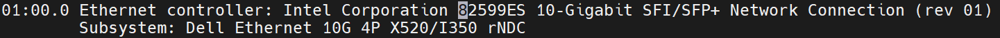
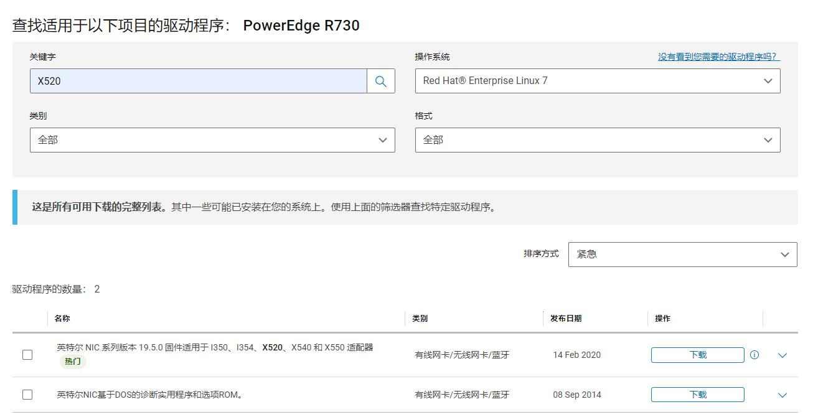

最近在一批比较老的服务器上部署了vhostuser类型的虚拟机，虚拟机创建后发现无法对外通信，经排查发现物理网卡未能成功执行offload操作，发出报文的inner_tcp_csum是错的，导致被对端或网关丢包。初步怀疑是网卡固件版本太低导致。

网卡固件跟网卡驱动不太一样，OEM厂商通常都会自己定制固件，而且一种网卡对应多个型号，每个型号的固件版本通常都不一样。

首先通过lspci -vvv发现网卡是DELL的板载卡：

查看服务器具体型号：

登录官网下载：
https://www.dell.com/support/home/zh-cn/product-support/product/poweredge-r730/drivers

下载之后是个.BIN文件，直接执行即可。

报错提示无法获取设备内存信息，需要升级驱动，那么去Intel官网下载最新驱动：
https://downloadcenter.intel.com/product/32609/Intel-82599-10-Gigabit-Ethernet-Controller
然后编译、打包、安装：
```
rpmbuild -tb ixgbe-5.11.3.tar.gz
rpm -ivh ixgbe-5.11.3-1.x86_64.rpm
```
重新执行.bin文件升级成功，重启——问题解决。