**首先通过看文档：**
给客户端添加 server的函数主要是下面四个
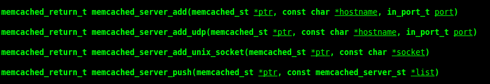
说明如下：
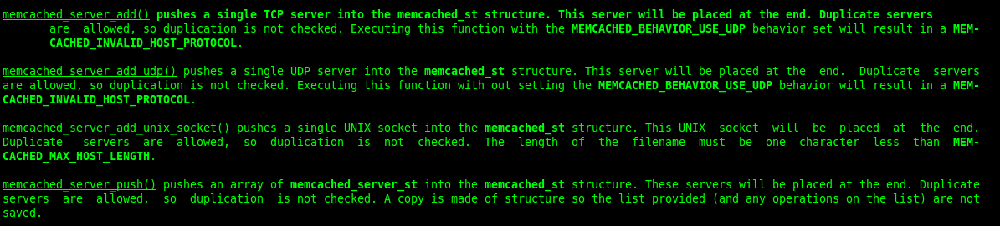
简单翻译一下（直说前面 2个）：

 - **Memcached_ser_add()** 函数添加一个 TCP的server 给memcached_st结构体，如果设置了 MEMCACHED_BEHAVIOR_USE_UDP将会返回一个MEMCACHED_INVALID_HOST_PROTOCOL错误。
 - **Memcached_ser_add_udp()** 函数添加一个 UDP的server 给memcached_st结构体，如果不设置 MEMCACHED_BEHAVIOR_USE_UDP将会返回一个MEMCACHED_INVALID_HOST_PROTOCOL错误。

然后我天真的相信了这个文档。
Memcached服务器监听口如下：

初始化代码如下：
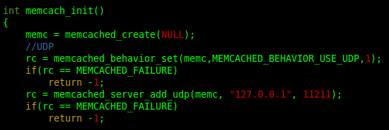
结果如下：
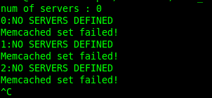
原因是没有成功添加 SERVER。我果断去看了下源码：
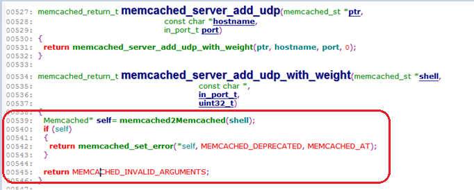
跟memcached_server_add()函数的代码比较了一下发现 memcached_server_add_udp()什么都没做，如果memcached_st已经定义告诉我 memcached服务器拒绝，如果没有定义告诉我无效的参数，真是会开玩笑。下面的 memcached_server_add()的代码：
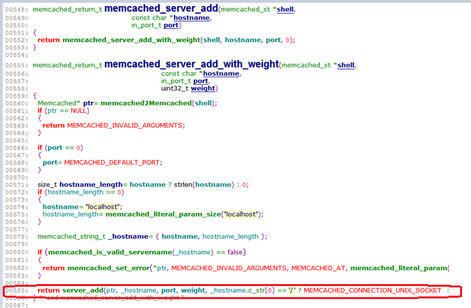
意外收获，如果memcached_server_add()的参数 hostname为“绝对”路径名，则默认是使用 UNIX Domain Socket方式进行通信，这非常有用，好啦，回到正题。
我果断跟进去瞧一瞧，server_add() –> __instance_create_with() :
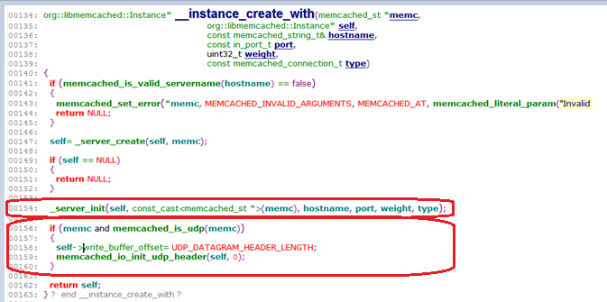

\_server_init()函数只是一些赋值操作，看到这里是有些 疑问○1， 后面再说；
我惊奇的发现，居然有 UDP的操作，看了一下memcached_is_udp()函数的代码：

不好意思，原来是一个宏，相信大家都很想知道怎样设置这个 flags.use_udp为真，直接改当然没有问题，但是我想到了 memcached_behavior_set()函数（其实之前看过memcached_behavior_set()的代码，所以看到这里时，我就明白了）；
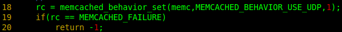
memcached_behavior_set() 就是设置 flags.use_udp为真；注意第三个参数就是要付给 flags.use_udp的值，所以一定要为1，否则 flags.use_udp仍为假。
虽说明白了，但是害的亲自测试一下才放心：
memcached服务器监听口：
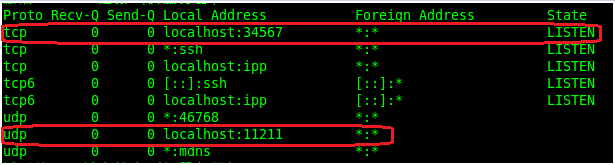
客户端初始化代码：
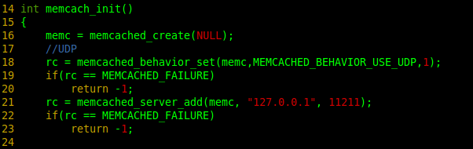
结果如下：
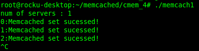

疑问 01：type是用来指定什么的？
\_Server_init()函数中

Self 为struct Instance 类型，其中
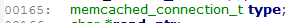
原来
每个客户端(struct memcached_st) 只能使用一种通信方式（ TCP OR UDP）；
每个server （struct Instance ）只能使用一种连接方式（ Socket OR UNIX Domain Socket）；
Memcached如果指定使用 UNIX Domain Socket通信方式则不能设置TCP和 UDP端口。
所以一共有三种通信方式： TCP/UDP/UNIX Domain Socket。
