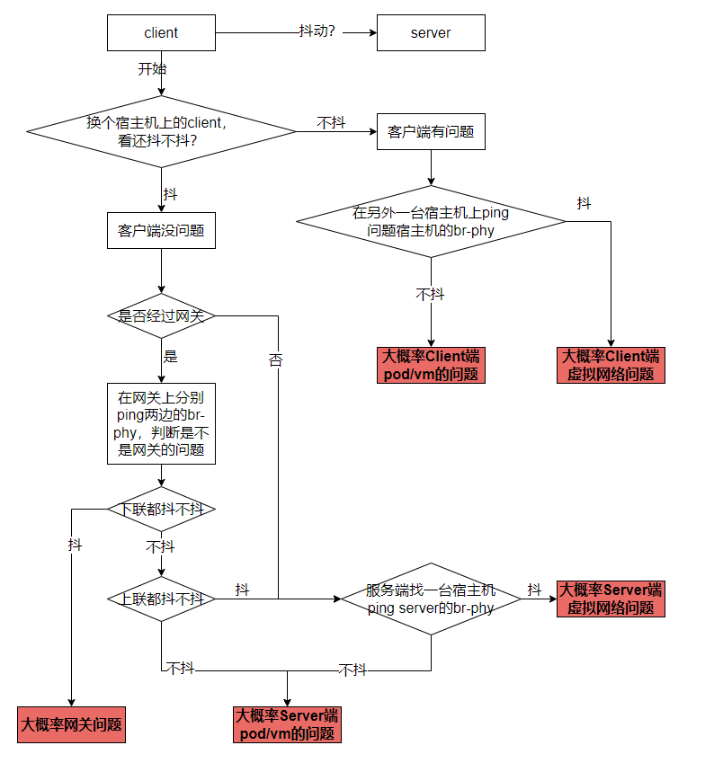
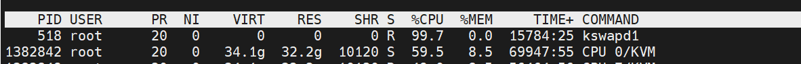
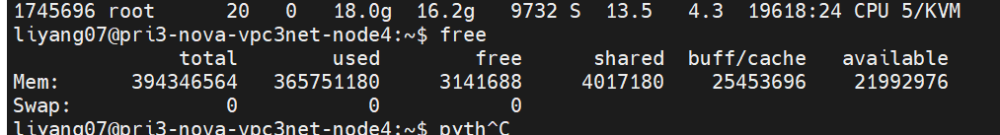
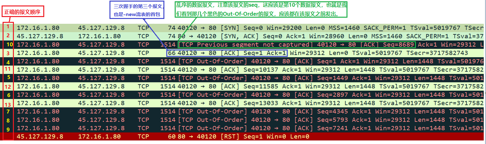
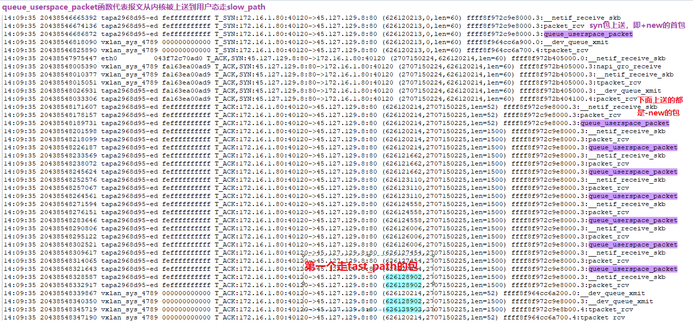
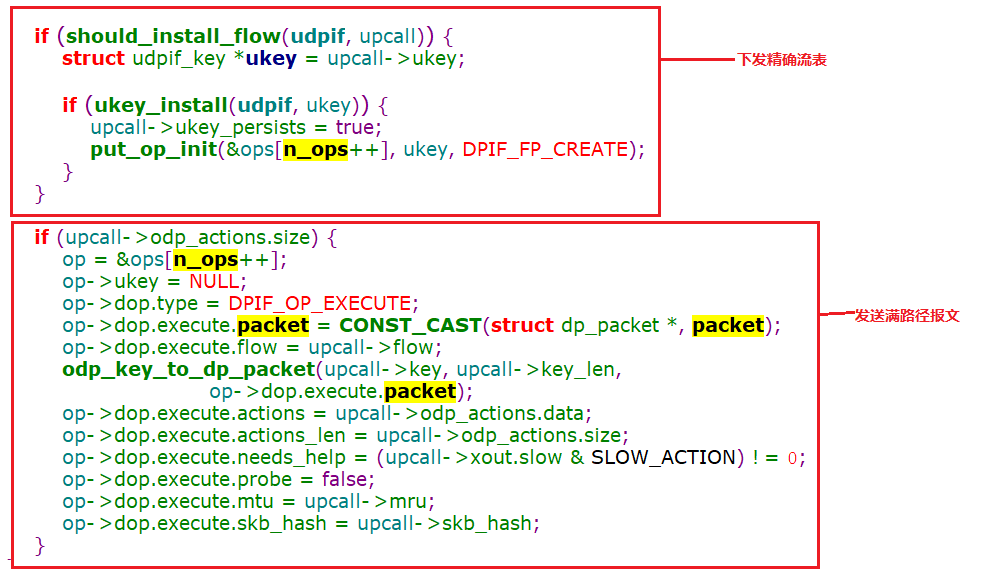

# 1. 时延抖动问题
时延抖动比较难搞，对于通过ping能够稳定复现的场景，解决思想是，尽量缩小范围、不断简化场景，最终确认问题。对于ping测试就能稳定规律复现的时延问题，可以借鉴下面的流程大概判断下问题所在的点，然后再深入排查。

上面是基本的排查流程，实际具体问题要具体分析。例如严选sriov节点hw csum问题为客户端问题，换一台宿主机没有复现，所以先确定了本次是客户端问题。但是实际情况是，另外一台测试用的sriov节点也存在该问题，没触发而已。所以具体问题还是要具体分析。
当然也可以从现象直接入手，例如云信、云音乐通过DGW访问物理节点，由于group采用五元组匹配，所以upcall过多，ovs负载高所以产生延迟抖动。类似于这种典型的问题，可以直接套现象，缩短排查时间。

## 1.1 如果是计算节点虚拟网络问题

1）pmd绑定的cpu是否被隔离，没有隔离延迟在所难免；
2）pmd是否满载，pmd满载延迟在所难免；
3）主机内存资源是否耗尽，主机内存耗尽会触发cpu回收缓存的机制。每个cpu会被定期打断执行缓存回收任务，会导致延迟；
4）看一下ovs主线程的cpu利用率，正常没有负载的，但是当ovs精确流量打到百万级别时，每次查询精确流表总数，会导致ovs cpu使用率升高，这对于br-phy等走ovs主线程的流量，会导致延迟增加；
5）upcall太多导致的抖动，升级proton-access-agent解决；

## 1.2 如果是vm、pod网络有问题

1）超售节点：判断是否为超售节点，如果是并且实际虚拟机分配cpu超过物理cpu总数，那么建议用户把业务迁移到非超售节点，延迟敏感业务不建议部署在超售节点上；
2）业务资源耗尽：看一下业务所在vm/pod的cpu利用率，如果存在多个满载cpu，那么建议业务扩容；
3）如果是sriov虚拟机，看下内核参数intremap=nopost是否启用，没启动也会导致延迟；
4）把vm/pod收包队列设置为1，排除是软中断调度导致的延迟；
5）Top -H + free -m看下cpu和mem使用率是否正常；

> 例如，云音乐的云主机节点，升级proton-access-agent解决了upcall太多导致的时延抖动后。还会出现延时抖动的情况。就是宿主机内存资源耗尽导致。整机只剩下3G内存，swap进程占用cpu 90%以上，并且占用的cpu还是云主机的cpu。

## 1.3 如果是网关问题

## 1.4 通用配置确认
1）cpu是否处于performance模式，如果不是延迟在所难免；
2）如果cpu仍处于performance模式，但是通过cpufreg-info查看cpu主频不稳定，请找SA确认是否bios设置了省电模式，网易内部很少这种情况，只在苏州移动碰到过；

## 1.5 更多排查思路
如果上面排查都没结果（严选这次就是过了一遍上面步骤没结果）。那么通常接下来排查不那么容易，要上一些必要的调试手段。

**首先要区分是内核问题还是ovs-dpdk问题：**
下面的方面仅供参考，具体问题具体分析。
比较有效的方式是找同节点一个vm、pod发起访问。如果没问题，那么可能pod、vm内部问题。这个方法仅供参考，实际不一定有用。
还有就是看日志：
1）dmesg日志，看有没有报错，例如ofed-4.5就会打印rx checksum fialed；
2）查看ovs日志，看是否有blocked 1000ms这种日志；
日志具体内容具体分析。但是这会指导你先去分析内核，还是先去分析ovs-dpdk。内核分析基本使用ebpf，我们cloud-op下面有skb-tracer工具，这次严选也是通过该工具做了初步排查。ovs-dpdk排查，可能有效的手段目前还是抓包。
SRIOV节点，还有一个有效的方式，就是VF互通来判断是否跟ovs有关。

## 1.6 对于ping测试体现不出来的时延

案例一：信息部云主机，从建德私有云访问滨江二期机房云主机数据库超时；
> 经抓发分析初步定位并非网络传输问题。如下图所示，client某个阶段发起数据请求并收到回复后，client等待了6s后才重新发起新的数据请求，从而导致超时，建议用户从client端进行排查：

案例二：建德私有云普通vpc k8s节点，网络卡顿
> ovs handler进程CPU占用资源较高，首先出现问题的节点网络流量并不大，4Wpps左右，但是至少8个handler进程cpu占用平均50%以上。并且信令口ssh登录都很卡，通过perf跟踪，资源基本耗在ipt_do_table()函数上，后经k8s同事一起排查，发现是部分进程有BUG，狂调netlink接口，整机的netlink调用都被阻塞；

# 2. 网络不通、异常

## 2.1 网络乱序导致的reset问题
**问题描述：**
业务在普通VPC云主机上执行nos上传操作，会出现tcp链接被nos端reset的情况，属于必现问题。

**软件版本：**
ovs：2.8.2+netease3-1（ovs-2.12上也可以复现）
kernel：2.8.2+netease3-1

**临时解决办法：**
业务在出现被reset的时候，紧接着再重传一次，因为很少有连续两次被reset的情况，目前基本可以满足业务需求。

**问题分析：**
1. 通过抓包基本确定，问题是由于tcp报文乱序导致的。正常情况下，tcp重组会解决tcp乱序问题，但是从抓包情况来看，当三次握手没有完成就出现乱序时，会触发tcp reset。
2. 解决思路有两条，一条是在云主机端定位乱序问题，一条是在nos服务端定位如何针对该情况关闭reset。由于服务端没有测试环境，所以无法调试，也不让改内核参数，所以定位起来非常麻烦，所以后面基本集中精力定位客户端的乱序问题。
3. 云主机关闭CT，发现不再出现reset情况，因此怀疑跟CT有关。CT有+new和-new两条流表，从问题上看，都是-new流表的首包发出去慢了，比后面的数据报文要慢，如下图：

4. 写了个ebpf工具分析下+new和-new流标创建过程中报文的传输情况（如下图），可以看到只要-new流表不下发，报文就会一直被上送（而不是只有首包会上送），那么第一个走fast_path的包会不会就是上面乱序的包呢？通过核对seq，确定答案就是如此。
    ==那么问题原因很清楚了——乱序的那个报文刚好赶在了精确流标已下发，但是走慢路径的报文还没发出去的瞬间，乱序报文直接匹配精确流表走快路径先发出去了。 #F44336==

**解决方法：**
1. 通过查看ovs代码，发现ovs是先下发精确流表再发送慢路径的报文（如下图）。将两块代码顺序调了一下，经验证问题修复（理论上也是有可能会复现该问题，只是概率非常非常低，目前跑了十几遍测试还没复现，代码修改前跑一遍即可复现）：

## 2.2 组播报文导致的网络不通
