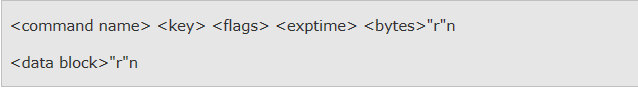
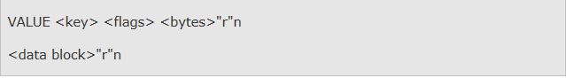
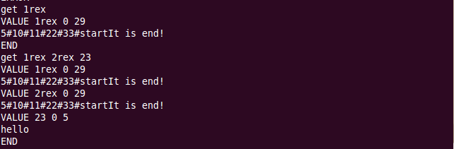
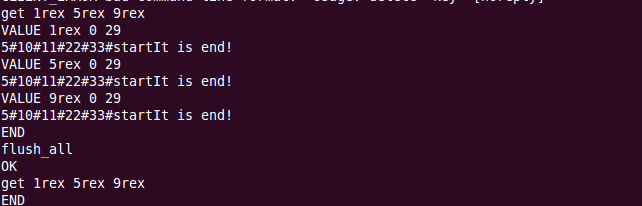
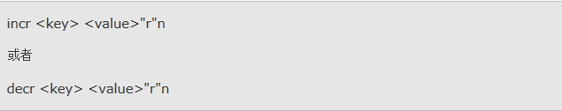
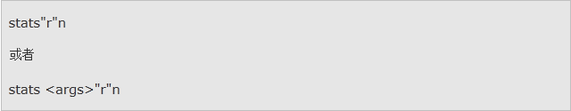
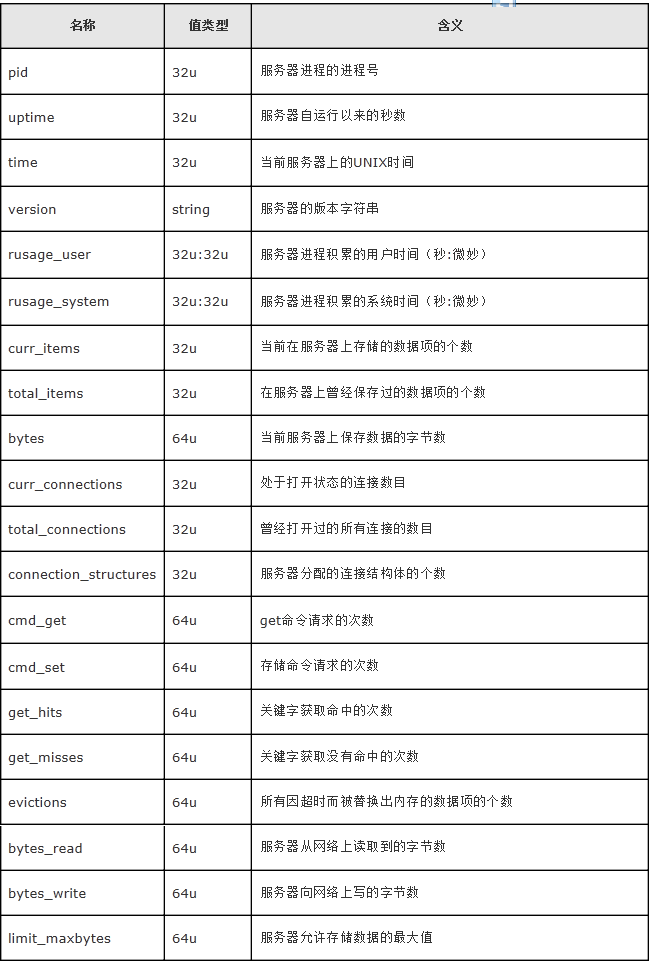
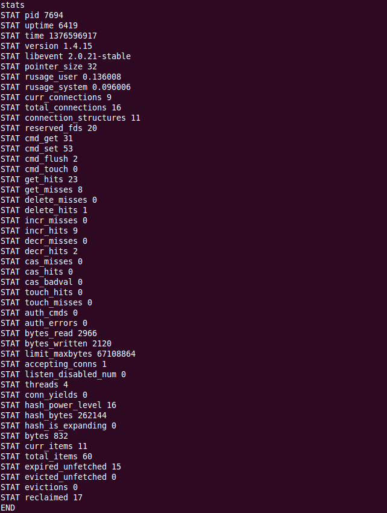

**Memcached的key一定不能有空格**

## 1. 常用参数

``` haml
memcached -m 64 -M -u root -d -l 127.0.0.1 -p 11211 -U 11212
# -m 指定缓存所使用的最大内存容量，单位是Megabytes，默认是64MB
# -u 只有以root身份运行时才指定该参数
# -d 以daemon的形式运行
# -l 指定监听的地址
# -p 指定监听的TCP端口号，默认是11211
# -t 指定线程数，默认是4个
# -h 打印帮助信息
# -c 最大同时连接数，默认是1024.
# -U 指定监听的UDP端口号，默认是11211
# -M 内存耗尽时显示错误，而不是删除项
# -f 块大小增长因子，默认是1.25
# -n 最小分配空间，key+value+flags默认是48
# “-d”参数需要进行进一步的解释
#     -d install 安装memcached
#    -d uninstall 卸载memcached
#    -d start 启动memcached服务
#    -d restart 重启memcached服务
#    -d stop 停止memcached服务
#    -d shutdown 停止memc
```

## 2. Memcached的命令（memcached有三种类型的命令）

### 2.0 出错信息

每个命令都有可能被反馈以一个错误消息。这些错误消息有以下三个类型：
**ERROR**
意味着客户端发送了一个在协议中不存在的命令。
**CLIENT_ERROR** 
表示客户端输入的命令行上存在某种错误，输入不符合协议规定。是一个人工可读（human-readable）的错误注释。
**SERVER_ERROR**
表示服务器在执行命令时发生了某些错误，致使服务器无法执行下去。也是一个人工可读（human-readable）的错误注释。在一些情况下，错误导致服务器不能再为客户端服务（这样的情况很少发生），服务器就会在发生错误消息后主动关闭连接。这也是服务器主动关闭到客户端连接的唯一情况。

### 2.1 存储命令
**命令格式：**
3个命令：set、add和replace，要求服务器按照关键字存储数据。
客户端先发送一个命令行，然后才可以发送一个数据块；命令执行后客户端等待一行反馈，用来表示命令执行成功与否。


**参数说明：**
 - "command name"是 set、add或者replace。set表示存储该数据；add表示如果服务器没有保存该关键字的情况下，存储该数据；replace表示在服务器已经拥有该关键字的情况下，替换原有内容。
 - "key"是客户端要求服务器存储数据的关键字。
 - "flags"是一个16位的无符号整数，服务器将它和数据一起存储并且当该数据被检索时一起返回。客户端可能使用该数值作为一个位图来存储特殊数据信息；这个字段对服务器不是透明的。
 - "exptime"是超时时间。如果值为0表示该数据项永远不超时（但有时候该数据项可能被删除以为其他数据腾出空间）；如果值不为0，可能是绝对的UNIX时间，也可能是自现在开始的偏移值，它保证客户段在这个超时时间到达后，客户端将取不到该数据项。
 - "bytes"是随后数据的字节数，不包括终结符”"r"n”。有可能是0，它后面将是一个空的数据块。
 - "data block"是真正要存储数据流。

 **返回结果：**
 发送命令行和数据后，客户端等待反馈，可以是如下几种情况：
 - STORED表示存储数据成功。
 - NOT_STORED表示发送的数据没有存储，但这不因为错误，而是发生在add或者replace命令不能满足条件时，或者数据项正处于要删除的队列中。
 - 错误消息


### 2.2 读取命令

**命令格式：**


返回的数据格式


发送命令后，客户端等待返回一个或多个数据项，每个数据项的格式是一个文本行，后跟着一个数据块。当所有的数据项发送完毕后，服务器发送字符串”END"r"n”表示服务器反馈数据的结束。

 - “key”是发生数据项的关键字。
 - "flags"是存储该数据项时，客户端命令中的标志字段。
 - "bytes"是紧跟文本行后数据块的长度，不包括终结符”"r"n”。
 - "datablock"是数据项的数据部分。
如果请求命令行中的有些关键字对应的数据项没有被返回，这意味着服务器没有该关键字标示下的数据项（有可能是从来没有被存储过，或者存储过但被删除掉以腾出内存空间，或者数据项超时了，再或者它被某个客户端删除了）。


### 2.3 删除命令
delete每次只能删除一个K-V对象


 - “key”是客户端希望服务器删除数据项的关键字
 - "time"是客户端希望服务器阻止add和replace命令使用该关键字数据项的秒数，可以是相对时间也可以是UNIX的绝对时间。在这段时间内，数据项被放入一个删除队列，它不能被get命令读取，在其上使用add和replace也会失败，但使用set命令可以成功。当这个时间过去后，数据项从服务器的内存中真正的删除。该参数是可选参数，如果不存在默认为0，这意味着立即从服务器上删除。

服务器返回信息：

 - "DELETED"r"n" 表示数据项删除成功
 - "NOT_FOUND"r"n" 表示该关键字指定的数据项在服务器上没有找到
 - 其他错误消息


### 2.4 flush_all命令
清除memcached中的所有数据


### 2.5 incr/decr命令


注意：

 - 命令中的value不是K-V对象中的value，而是对应的“加数”或者“减数”，K-V对象中value将会加上或者减去这个值，这个值是一个32位无符号整数。
 - 只有K-V对象的value全部为数字时（即数字之间可以有空格，但是不可有任何其他字符），才可以使用incr/decr命令，当有很多被空格隔开的数字时，只操作第一个数字。


### 2.6 stats命令

“stats”命令用来查询服务器的运行情况和其他内部数据。它有两种情况，以有无参数来区分：



当接收到没有带参数的“stats”命令后，服务器发送许多类似与如下格式的文本行：


在所有STAT文本行中，是该统计项目的名称，是其数据。下面是一份stats命令反馈的所有统计项目的列表，后面跟着其值的数据类型。在数据类型列中，”32u”表示一个32位无符号整数，”64u”表示一个64位无符号整数，”32u:32u”表示是两个用冒号分割的32位无符号整数。





### 2.7 quit命令

"quit"是一个没有参数的命令。其格式如下


当服务器接受到此命令后，就关闭与该客户的连接。不管怎样，客户端可以在任意不需要该连接的时刻关闭它，而不需要发送该命令。


### 2.8 version命令

返回版本信息


服务器发回的反馈信息如下：

 - **"VERSION "** 是从服务器返回的版本字符串。
 - **错误消息:**


## 3. 关于通信

### 3.1 协议

memcached的客户端通过TCP连接与服务器通信（UDP协议的接口也可以使用，详细说明请参考”UDP 协议”部分）。一个给定的运行中的memcached服务器在某个（可配置的）端口上监听连接；客户端连接该端口，发送命令给服务器，读取反馈，最后关闭连接。

没有必要发送一个专门的命令去结束会话。客户端可以在不需要该连接的时候就关闭它。注意：我们鼓励客户端缓存它们与服务器的连接，而不是每次要存储或读取数据的时候再次重新建立与服务器的连接。memcache同时打开很多连接不会对性能造成到大的影响，这是因为memcache在设计之处，就被设计成即使打开了很多连接（数百或者需要时上千个连接）也可以高效的运行。缓存连接可以节省与服务器建立TCP连接的时间开销（于此相比，在服务器段为建立一个新的连接所做准备的开销可以忽略不计）。

memcache通信协议有两种类型的数据：文本行和非结构化数据。文本行用来发送从客户端到服务器的命令以及从服务器回送的反馈信息。非结构化的数据用在客户端希望存储或者读取数据时。服务器会以字符流的形式严格准确的返回相应数据在存储时存储的数据。服务器不关注字节序，它也不知道字节序的存在。memcahce对非结构化数据中的字符没有任何限制，可以是任意的字符，读取数据时，客户端可以在前次返回的文本行中确切的知道接下来的数据块的长度。

文本行通常以“"r"n”结束。非结构化数据通常也是以“"r"n”结束，尽管"r、"n或者其他任何8位字符可以出现在数据块中。所以当客户端从服务器读取数据时，必须使用前面提供的数据块的长度，来确定数据流的结束，二不是依据跟随在字符流尾部的“"r"n”来确定数据流的结束，尽管实际上数据流格式如此。

### 3.2 关键字 Keys
memcached使用关键字来区分存储不同的数据。关键字是一个字符串，可以唯一标识一条数据。当前关键字的长度限制是250个字符（当然目前客户端似乎没有需求用这么长的关键字）；关键字一定不能包含控制字符和空格。

### 3.3 UDP协议
当基于TCP协议的连接数超过TCP连接的上限时，我们可以使用UDP协议来替代。但是UDP协议接口不提供可靠的传输，所以多用在不严格要求成功的操作上；典型的get请求会因为缓存的问题，引起丢失或者不完整的传输。

每个UDP数据包包含一个简单的帧头，接着就是如TCP协议描述的数据格式的数据流。在当前的实现中，请求必须包含在一个单独的UDP数据包中，但返回可能分散在多个数据包中。（唯一的可以拆分请求数据包的是大的多关键字get请求和set请求，鉴于可靠性相比而言他们更适合用TCP传输。）

帧头有8字节长，如下是其格式（所有的数字都是16位网络字节序整形，高位在前）：

0 - 1 请求ID
2 - 3 序列号
4 - 5 在当前的消息中含有的数据包的个数
6-7 保留以后使用，当前必须为0

请求ID由客户端提供。它的典型值是一个从随机种子开始递增值，实际上客户端可以使用任意的请求ID。服务器的反馈信息中包含了和请求命令中一样的请求ID。客户端凭借这个请求ID区分来自于同一服务器的反馈。每一个包含未知请求ID的数据包，可能是由于延时反馈造成，这些数据包都应该抛弃不用。

序列号从0到n-1，n是消息中总的数据包的个数。客户端按照序列号排序重组数据包；结果序列中包含了一个完整的如TCP协议一样格式的反馈信息（包含了“"r"n”总结字符串）。