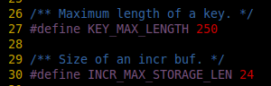
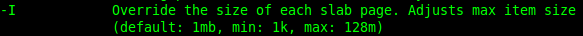

memcached.h中规定key的长度要小于250byte


slab（slab（value）的长度限制默认是1M，可以使用-I选项更改此限制value）的长度限制默认是1M，可以使用-I选项更改此限制



```
-I            Override the size of each slab page. Adjusts max item size
              (default: 1mb, min: 1k, max: 128m)
```

要增加的话，启动时添加-I 10m参数就可以,会有一个警告：

WARNING: Setting item max size above 1MB is not recommended! Raising this limit increases the minimum memory requirements and will decrease your memory efficiency.