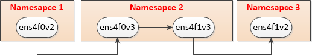

## 1. 测试拓扑

## 2. 配置脚本

1）添加network namespace
ip netns add net1
ip netns add net2
ip netns add net3
2）将VF添加到对应netns
ip link set ens4f0v2 netns net1
ip link set ens4f0v3 netns net2
ip link set ens4f1v3 netns net2
ip link set ens4f1v2 netns net3
3）为每个VF配置IP
ip netns exec net1 ifconfig ens4f0v2 192.168.1.11/24 up
ip netns exec net2 ifconfig ens4f0v3 192.168.1.12/24 up
ip netns exec net2 ifconfig ens4f1v3 192.168.2.12/24 up
ip netns exec net3 ifconfig ens4f1v2 192.168.2.11/24 up
4）为netns添加路由
ip netns exec net1 route add -net 192.168.2.0/24 gw 192.168.1.12 dev ens4f0v2
ip netns exec net3 route add -net 192.168.1.0/24 gw 192.168.2.12 dev ens4f1v2

> 注意：路由需要指定网关，否则需要手动设置arp；

5）设置VF的vlan
ip link set ens4f0 vf 2 vlan 1002
ip link set ens4f0 vf 3 vlan 1002
ip link set ens4f1 vf 3 vlan 1003
ip link set ens4f1 vf 2 vlan 1003

## 3. 带宽测试
测试方法1：
ip netns exec net2 iperf -s -i1
ip netns exec net1 iperf -c 192.168.1.12 -i1 -t6000 -P4

测试方法2：
ip netns exec net3 iperf -s -i1
ip netns exec net1 iperf -c 192.168.2.11 -i1 -t6000 -P4