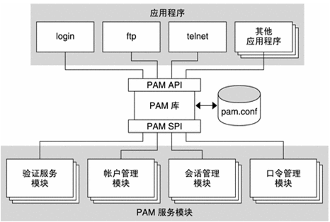
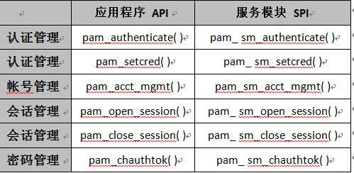
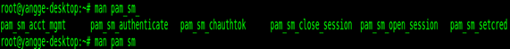
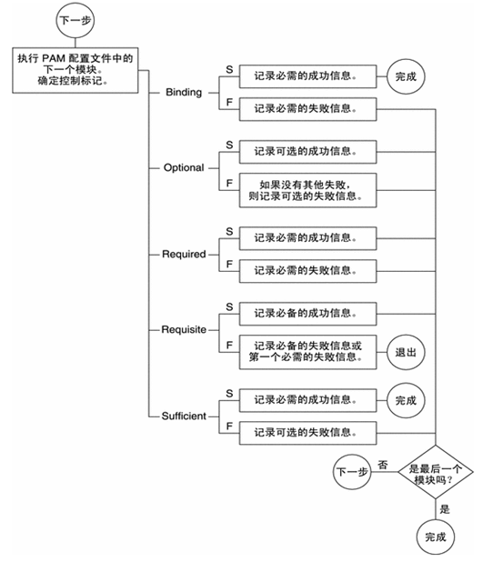
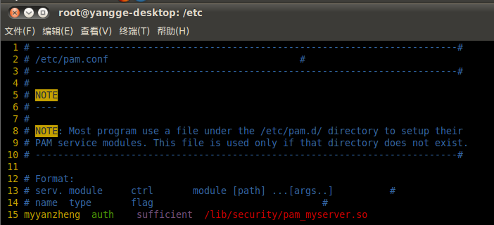
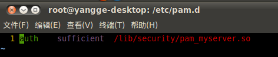

## 1. Pam概述

PAM（Pluggable Authentication Modules ）是由Sun提出的一种认证机制。它通过提供一些动态链接库和一套统一的API，将系统提供的服务和该服务的认证方式分开，使得系统管理员可以灵活地根据需要给不同的服务配置不同的认证方式而无需更改服务程序，同时也便于向系统中添加新的认证手段。

## 2. Pam框架

pam框架有以下四部分组成：

 - PAM 应用程序，也称为消费方;
 - PAM 库;
 - PAM 配置文件;
 - PAM 服务模块，也称为提供者;

该框架可为与验证相关的活动提供统一的执行方式。采用该方式，应用程序开发者可使用 PAM 服务，而不必了解策略的语义。算法是集中提供的。可以独立于各个应用程序对算法进行修改。借助 PAM，管理员可以根据特定系统的需要调整验证过程，而不必更改任何应用程序。调整是通过 PAM 配置文件 pam.conf 来执行的。

下图说明了 PAM 体系结构。应用程序通过 PAM 应用编程接口 (application programming interface, API) 与 PAM 库进行通信。PAM 模块通过 PAM 服务提供者接口 (service provider interface, SPI) 与 PAM 库进行通信。通过这种方式，PAM 库可使应用程序和模块相互进行通信。



## 3. Pam服务模块

PAM 服务模块是一个共享库（动态链接库），用于为系统登录应用程序（如 login、rlogin 和 telnet）提供验证和其他安全服务。四种类型的PAM服务是：

 1. 验证服务模块 用于授予用户访问帐户或服务的权限。提供此服务的模块可以验证用户并设置用户凭证。pam_authenticate () | pam_setcred ()
 2. 帐户管理模块 用于确定当前用户的帐户是否有效。提供此服务的模块可以检查口令或帐户的失效期以及限时访问。pam_acc_mgmt ()
 3. 会话管理模块 用于设置和终止登录会话。pam_open_session () | pam_close_session ()
 4. 口令管理模块 用于强制实施口令强度规则并执行验证令牌更新。pam_chauthok ()

一个 PAM 模块可以实现其中的一项或多项服务。将简单模块用于明确定义的任务中可以增加配置灵活性。因此，应该在不同的模块中实现PAM服务。然后，可以按照 pam.conf 文件中定义的方式根据需要使用这些服务。

每个使用PAM认证的应用程序都以pam_start开始，pam_end结束。实际做认证工作的API函数有六个（以下将这六个函数简称为认证API）：



应用程序的API还有很多，但是服务模块的API只有6个，如下图：


其中应用程序API的函数原型均为：

```
int
pam_xxx(    
pam_handle_t *pamh, //传递给SPI的参数，对应SPI参数中的pamh
int flags //传递给SPI的参数，对应SPI参数中的flags
);
```

其中服务模块SPI的函数原型均为：

```
PAM_EXTERN int
pam_sm_xxx(    //本文中红色标记处为SPI参数的来源
pam_handle_t *pamh,
 int flags,
 int argc,
 const char **argv
);
```

## 4. Pam库

PAM 库 libpam 是PAM体系结构中的中心元素：

 1. libpam 可以导出 API pam。应用程序可以调用此API以执行验证、帐户管理、凭证建立、会话管理以及口令更改。
 2. libpam 可以导入主配置文件 pam.conf。PAM 配置文件可指定每种可用服务的PAM模块要求。pam.conf 由系统管理员进行管理。
 3. libpam 可以导入SPI pam_sm，而导出则由服务模块完成。

## 5. Pam配置文件（/etc/pam.conf）

该文件是由如下的5项所组成的：


### 5.1 service-name

应用的名字，比如telnet、login、ftp等，服务名字“OTHER”代表所有没有在该文件中明确配置的其它服务。

### 5.2 module-type

模块类型有四种：auth、account、session、password，即对应PAM所支持的四种管理方式。同一个服务可以调用多个 PAM模块进行认证，这些模块构成一个stack。

### 5.3 control-flag

 1. 用来告诉PAM库该如何处理与该服务相关的PAM模块的成功或失败情况。它有四种可能的 值：required，requisite，sufficient，optional。
 2. required 表示本模块必须返回成功才能通过认证，但是如果该模块返回失败的话，失败结果也不会立即通知用户，而是要等到同一stack 中的所有模块全部执行完毕再将失败结果返回给应用程序。可以认为是一个必要条件。
 3. requisite 与required类似，该模块必须返回成功才能通过认证，但是一旦该模块返回失败，将不再执行同一stack内的任何模块，而是直 接将控制权返回给应用程序。是一个必要条件。注：这种只有RedHat支持，Solaris不支持。
 4. sufficient 表明本模块返回成功已经足以通过身份认证的要求，不必再执行同一stack内的其它模块，但是如果本模块返回失败的话可以 忽略。可以认为是一个充分条件。
 5. optional表明本模块是可选的，它的成功与否一般不会对身份认证起关键作用，其返回值一般被忽略。
 6. Binding

### 5.4 module-path

用来指明本模块对应的程序文件的路径名，一般采用绝对路径，如果没有给出绝对路径，默认该文件在目录/usr/lib/security下 面。

### 5.5 arguments（此处的参数传递给SPI,对应着SPI参数中的 argc 和 argv）

是用来传递给该模块的参数。一般来说每个模块的参数都不相同，可以由该模块的开发者自己定义，但是也有以下几个共同 的参数：

 1. debug  该模块应当用syslog( )将调试信息写入到系统日志文件中。
 2. no_warn  表明该模块不应把警告信息发送给应用程序。
 3. use_first_pass  表明该模块不能提示用户输入密码，而应使用前一个模块从用户那里得到的密码。
 4. ry_first_pass  表明该模块首先应当使用前一个模块从用户那里得到的密码，如果该密码验证不通过，再提示用户输入新的密码。
 5. use_mapped_pass  该模块不能提示用户输入密码，而是使用映射过的密码。
 6. expose_account  允许该模块显示用户的帐号名等信息，一般只能在安全的环境下使用，因为泄漏用户名会对安全造成一定程度的威 胁。

如果对于该服务的操作（如验证或帐户管理）/etc/pam.conf 仅包含一个模块，则该模块的结果将确定操作的结果。

如果为服务操作定义了多个模块，那么这些模块就堆叠起来，即，对于该服务存在一个 PAM 堆栈。下图说明如何为每种类型的控制标志记录成败信息



其实在linux系统中，/etc/pam.conf这个配置文件已经起不到什么作用了，因为它的作用完全被/etc/pam.d/中“对应”的配置文件代替了。/etc/pam.d/中“对应”的配置文件就是以/etc/pam.conf中service-name项的“值”命名的。如下图所示：



上图中service-name的值为myyanzheng，那么在/etc/pam.d/中就有这样一个名字为myyanzheng的文件，其内容如下图所示：



可以看到上图中配置文件myyanzheng的内容只比/etc/pam.conf少了service-name一项，之所少这一项，因为该配置文件的名字就是service-name。