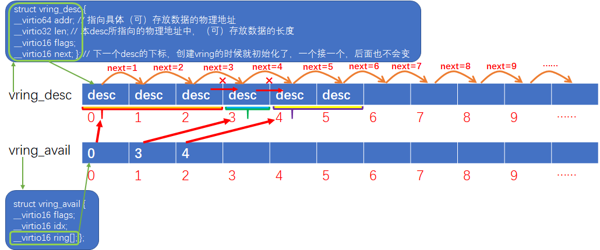
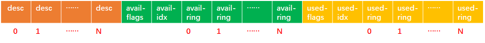
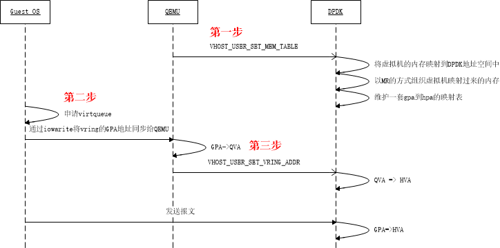

## 1. virtio的ring结构
Virtio设备是支持多队列，每个队列由结构vring_virtqueue定义（可以是收包队列也可以是发包队列），而每个vring_virtqueue中都定义了一个vring结构，负责具体的数据传输。

``` code
// include/uapi/linux/virtio_ring.h
struct vring {
        unsigned int num;

        struct vring_desc *desc;

        struct vring_avail *avail;

        struct vring_used *used;
};
```
可见，ving不是一个ring环，而是包含了三个ring环，利用着三个ring环实现报文的收发。我们通过一张图来描述三个ring环的作用及关系：


**1. vring_desc**
Struct vring_desc并没有定义一个ring环，而是定义了ring环中每个元素的结构。上图中已经对vring_desc各成员做了注解。Desc ring没有消费者和生产者，我们可以把它看作一块用来交互数据的共享内存。

> 说明：vring_desc结构中的addr成员，在Guest向外发包的场景中，指向的是一块承载了发包数据的内存，而在Guest从外面收包的场景中，指向的是一块预分配好的空内存，Host会将收到的包存放到这块空内存中。

**2. vring_avail**
Struct vring_avail是定义了一个ring环的（即成员ring[]），这个ring环的生产者是Guest中的virtio-net，消费者是Host中vhostuser/vhostnet。Avail ring环中每个元素即指向desc ring的下标。

> 说明：Avail ring和desc ring的长度都是一样的，但是avail ring并不会指向desc ring的每一个desc。例如有些skb是由多个分片组成的（scattergather），那么这个skb实际会被转换成多个desc，并且通过vring_desc中的next将多个desc链接在一起，最后一个desc通过flag标记结束。那么这种情况下，Avail ring只会存储第一个desc的下标，同时vring_avail的idx也只累加1。

**3. vring_used**
 Struct vring_used跟vring_avail类似，不过used ring的生产者是vhostnet/vhostuser，消费者是virtio-net。
 
> 说明：used ring中的每个元素包含两个成员id和len，id指向desc ring中的下标，而len则指向desc中所存储数据的长度(通常len成员只在Guest从外面收包的场景中才有效，这个时候desc中len指的是内存中可以最大存储的数据的长度，而user ring中的len指的则是内存中实际存储的数据的长度）。

那么这三个ring在内存中是怎么分布的呢？我们通过一张图描述下：


如图，三个ring是分布在一块连续的内存中的（物理/虚拟地址都是连续的）。最前面是desc ring，接下来是avail ring，最后是used ring。

## 将vring映射到vhostuser
Virtio队列中的vring是由Guest中的virtio-net驱动申请的，那么vhostuser如何操作这些vring呢？答案是virtio-net在申请好vring后需要将vring的地址告诉vhostuser。我们通过一张图，看一下虚拟机启动时所涉及到的内存注册过程：


如上图所示，整个内存注册过程分为三个步骤：
**第一步：**
QEMU未虚拟机申请内存，并将虚拟机的整个内存注册到vhostuser。你没看错，确实是需要将虚拟机的整个内存都注册到vhostuser驱动中。

> 说明：Vhostuser和QEMU通过unix socket建立了通信连接，两者通过该连接进行协商。

**第二步：**
Guest中的virtio-net驱动申请队列（即virtqueue），并将队列中的vring地址同步给QEMU。
``` code
// 追踪从virtio-net开始初始化到创建virtqueue，函数位置：linux-kernel-src/drivers/virtio/
|virtio_pci_probe
| |virtio_pci_legacy_probe / virtio_pci_modern_probe
| |	|setup_vq
| |	| |vring_create_virtqueue
| | | | |vring_create_virtqueue_split
| | | | | |void *queue = vring_alloc_queue // 申请vring的地址
| | | | | |vring_init(struct vring *, queue)
| | | | | |__vring_create_virtqueue
| | | |iowrite32(VIRTIO_PCI_QUEUE_PFN) // 将vring_addr注册到QEMU
```
> 说明：Virtio-net和QEMU之间的通信不是通过什么scoket，而是由virtio-net向一段特定的io空间写数据实现的。不单单QEMU是这样做的，包括VMWARE也是这么做的（XEN不熟悉）。同理，QEMU向GUEST发起的数据请求也都是都通过IO实现的。

**第三步：**
QEMU在enable每个virtqueu的时候，会将virtqueue中三个vring的长度及地址注册到vhostuser。并且初始化三个vring中消费者/生产者的位置。

``` code
// vhostuser中相关协商处理函数
static vhost_message_handler_t vhost_message_handlers[VHOST_USER_MAX] = {
	......
	[VHOST_USER_SET_VRING_NUM] = vhost_user_set_vring_num,
	[VHOST_USER_SET_VRING_ADDR] = vhost_user_set_vring_addr,
	[VHOST_USER_SET_VRING_BASE] = vhost_user_set_vring_base,
	......
};
```

## Guest向外发包

``` code
// 函数位置：linux-kernel-src/drivers/net/virtio-net.c
|start_xmit
| |free_old_xmit_skbs // 每次发包前，先清理上一次已成功发送的包
| |xmit_skb
| | |virtqueue_add_outbuf
| | | |virtqueue_add
| | | | |virtqueue_add_split
```
这里面virtqueue_add()是一个通用的函数，不管收包还是发包，都是通过调用virtqueue_add()函数实现：

``` code
static inline int virtqueue_add(struct virtqueue *_vq,
                                struct scatterlist *sgs[],
                                unsigned int total_sg,
                                unsigned int out_sgs,
                                unsigned int in_sgs,
                                void *data,
                                void *ctx,
                                gfp_t gfp)；
```
**参数解析：**

 - _vq，没什么好解释的，virtqueue被包含在vring_virtqueue中，几乎跟vring传输相关的所有内容都定义在vring_virtqueue中；
 - sgs，元素为scatterlist的列表；这里需要额外注意，每个scatterlist本身也是一个列表；举个例子，一个skb可以由多个分片构成，多个分片内存上是不连续的，在没有scatter-gather之前或者禁用scatter-gather的情况下，驱动需要将所有分片拷贝到一块连续的内存上，而开启scatter-gather后，我们不必再重新拷贝报文分片，直接通过scattherlist将报文的多个分片串联起来，供网卡驱动使用。可以说scatterlist是skb在网卡驱动中的表示；
 - total_sg，所有scatterlist中分片加起来的总数，每个分片都占用一个独立的desc，所以total_sg表明接下来要消耗的desc总数；
 - out_sgs，sgs中有多少是out_sg；
==说明： #F44336==scatterlist是分为out_sg（只读）和in_sg（可读可写）两种类型的。当Guest发送报文的时候，使用out_sg，当Guest打算收包，需要先将可承载报文数据的内存通过desc ring传递到vhost的时候，就使用in_sg。此外需要注意，我们发包的时候，只会传递out_sg给virtqueue_add()，收包的时候只传递in_sg给virtqueue_add()，还有一种通过virtqueue进行前后端协商和管理的virtqueue，会同时传递out_sg和in_sg给virtqueue_add（）。
 - int_sgs，sgs中有多少是in_sg；
 - data，要传输的内存起始地址；
==说明： #F44336==在发包场景中，就是要发送的skb的地址，注意是虚拟地址，而我们赋值给desc->addr是物理地址，那么这个data有啥用呢？用处就是这个报文被vhost成功处理发送后，virtio-net会通过used ring再次获取到已经被成功发送的报文，这个时候virtio-net需要释放报文，那么直接引用这个data指向的虚拟地址释放就可以了。
==说明: #F44336==在收包场景中类似，virtio-net填充预申请的空白内存给vhostuser收包，收到的报文会通过used ring再送回到virtio-net中，这个时候直接引用data即可对内存中的报文数据进行操作了。
==说明： #F44336==那么data存储再哪呢？下面代码解析里有介绍。
 - ctx，跟indirect相关，暂时不管；
 - gfp，跟indirect相关，暂时不管；

**virtqueue_add_split函数源码分析：**
==说明： #F44336==packed queus是virtio 1.1引入的新特性，我们暂时不管，先分析老的split模式。
``` code

static inline int virtqueue_add_split(struct virtqueue *_vq,
                                      struct scatterlist *sgs[],
                                      unsigned int total_sg,
                                      unsigned int out_sgs,
                                      unsigned int in_sgs,
                                      void *data,
                                      void *ctx,
                                      gfp_t gfp)
{
		......
		} else {
		// 非indirect模式
                indirect = false;
                desc = vq->split.vring.desc;
                i = head;
                descs_used = total_sg;
        }
		......
		// 如果desc ring没有空间了，赶紧通知vhost处理报文好腾地方
        if (vq->vq.num_free < descs_used) {
                pr_debug("Can't add buf len %i - avail = %i\n",
                         descs_used, vq->vq.num_free);
                /* FIXME: for historical reasons, we force a notify here if
                 * there are outgoing parts to the buffer.  Presumably the
                 * host should service the ring ASAP. */
                if (out_sgs)
                        vq->notify(&vq->vq);
                if (indirect)
                        kfree(desc);
                END_USE(vq);
                return -ENOSPC;
        }
		......
		// *************************************************************************
		// 第一步，填充desc ring
		// 本函数最核心的代码了，out_sg和in_sg的存放位置也是有讲究的，当同时又两种scatterlist时，
		// out_sg总是被放在前面，in_sg被存储在out_sg后面；
		for (n = 0; n < out_sgs; n++) {
                for (sg = sgs[n]; sg; sg = sg_next(sg)) {
						// 这里需要注意的是，通过desc->addr传递给vhost的是Guest的物理地址
                        dma_addr_t addr = vring_map_one_sg(vq, sg, DMA_TO_DEVICE);
                        if (vring_mapping_error(vq, addr))
                                goto unmap_release;

                        desc[i].flags = cpu_to_virtio16(_vq->vdev, VRING_DESC_F_NEXT);
                        desc[i].addr = cpu_to_virtio64(_vq->vdev, addr);
                        desc[i].len = cpu_to_virtio32(_vq->vdev, sg->length);
                        prev = i;
                        i = virtio16_to_cpu(_vq->vdev, desc[i].next);
                }
        }
        for (; n < (out_sgs + in_sgs); n++) {
                for (sg = sgs[n]; sg; sg = sg_next(sg)) {
                        dma_addr_t addr = vring_map_one_sg(vq, sg, DMA_FROM_DEVICE);
                        if (vring_mapping_error(vq, addr))
                                goto unmap_release;

                        desc[i].flags = cpu_to_virtio16(_vq->vdev, VRING_DESC_F_NEXT | VRING_DESC_F_WRITE);
                        desc[i].addr = cpu_to_virtio64(_vq->vdev, addr);
                        desc[i].len = cpu_to_virtio32(_vq->vdev, sg->length);
                        prev = i;
                        i = virtio16_to_cpu(_vq->vdev, desc[i].next);
                }
        }
        /* Last one doesn't continue. */
		// OK，对于发包场景，上面所有desc都是一个SKB的，现在这个SKB填充完毕，需要通过flag标记
		// desc的结束，前面介绍desc ring的时候介绍过，所有desc通过next成员链在一起，并且通过flag
		// 标记一个报文存储的结束。
        desc[prev].flags &= cpu_to_virtio16(_vq->vdev, ~VRING_DESC_F_NEXT);
		
		/* We're using some buffers from the free list. */
		// 用了多少，得从num_free中减掉
        vq->vq.num_free -= descs_used;

        /* Update free pointer */
        if (indirect)
				......
        else
				// 更新下一次开始填充的desc下标
                vq->free_head = i;
		......
		// vring_virtqueue又自己维护了一个跟desc ring长度相同的数组，专门用来存储对应desc中内存
		// 对应的虚拟地址
		vq->split.desc_state[head].data = data;
		......
		/* Put entry in available array (but don't update avail->idx until they
         * do sync). */
        // *************************************************************************
		// 第二步，填充avail ring
		// 上面是desc ring的填充，下main开始填充avail ring了，可以看到只需要将第一个desc
		// 填充到avail ring即可
        avail = vq->split.avail_idx_shadow & (vq->split.vring.num - 1);
        vq->split.vring.avail->ring[avail] = cpu_to_virtio16(_vq->vdev, head);
		
        /* Descriptors and available array need to be set before we expose the
         * new available array entries. */
        // 累加avail ring的生产者计数
        virtio_wmb(vq->weak_barriers);
        vq->split.avail_idx_shadow++;
        vq->split.vring.avail->idx = cpu_to_virtio16(_vq->vdev,
                                                vq->split.avail_idx_shadow);
		// *************************************************************************
		// num_added主要跟通知机制有关，下面章节详细介绍
        vq->num_added++;

        pr_debug("Added buffer head %i to %p\n", head, vq);
        END_USE(vq);

        /* This is very unlikely, but theoretically possible.  Kick
         * just in case. */
        if (unlikely(vq->num_added == (1 << 16) - 1))
                virtqueue_kick(_vq);
		......
```

## Guest从外面收包

``` code
|virtnet_poll()
| |virtnet_receive()
| | |virtqueue_get_buf()
| | | |detach_buf()
| | |receive_buf()
| | |try_fill_recv()
| | | |add_recebuf_xxx()
| | | | |virtqueue_add_xxx()
| | | | | |virtqueue_add()	
| | | |virqueue_kick()
```
我们从virtqueue_get_buf()函数开始看。该函数执行的是收包函数的第一步，还是以split模式为例，该函数会根据模式选择最终调用到virtqueue_get_buf_ctx_split()函数：

``` code
static void *virtqueue_get_buf_ctx_split(struct virtqueue *_vq,
                                         unsigned int *len,
                                         void **ctx)
{
		// 注意：该函数每次只收一个包
		......
		// 这一步先判断下used ring里有没有未处理的成员。贴一下more_used_split（）的代码：
		// return vq->last_used_idx != 
		//                    virtio16_to_cpu(vq->vq.vdev, vq->split.vring.used->idx);
		// ***************************************************************************
		// 这里需要说明的是，vring_virtqueue中定义了一个成员叫last_used_idx，last_used_idx是
		// virtio-net消费used ring的下标+1，也就是这一次将从last_used_idx这个位置开始消费used 
		// ring。而vring_used中的idx则是由生产者（也就是vhost）填充的，表示下一次将要填充的used 
		// ring的下标。
		// ***************************************************************************
		// 说明：Vring_avail和vring_used中的idx都是生产者填充的，而消费者都会在各自的virtqueue的
		// 结构中定义一个last_xxx_idx，表示上次消费的截至位置，以及下一次开始消费的位置。
        if (!more_used_split(vq)) {
                pr_debug("No more buffers in queue\n");
                END_USE(vq);
                return NULL;
        }
		
        /* Only get used array entries after they have been exposed by host. */
        virtio_rmb(vq->weak_barriers);

		// 获取要消费的used ring的下标
        last_used = (vq->last_used_idx & (vq->split.vring.num - 1));
        // 从used成员中获取指向的desc ring中的下标
		i = virtio32_to_cpu(_vq->vdev,
                        vq->split.vring.used->ring[last_used].id);
		// 获取这个报文的实际长度
		// 注意：这个报文可能是由多个desc构成的，下面的len是指所有desc中报文的总长度，并且报文的存
		// 储总是前面desc满了之后，再向下一个desc中存储数据。
        *len = virtio32_to_cpu(_vq->vdev,
                        vq->split.vring.used->ring[last_used].len);

		// 如果这个desc ring的下标超过数组长度，则发生错误。
		// ***************************************************************************
		// 特别注意：
		// 细心的同学可能已经发现，avail ring和used ring的生产者/消费者下标是不断累加的，然后使用
		// 的时候做一下“idx&(vring_num-1)”的操作来保证访问不越界。但是我们使用desc ring的下标并不
		// 是不断累加的，而是每次通过desc的next成员获取到的（观察上面virtqueue_add函数得分析）。所
		// 以我们从avail ring和used ring中获取得desc下标是直接得下标，不存在越界。
        if (unlikely(i >= vq->split.vring.num)) {
                BAD_RING(vq, "id %u out of range\n", i);
                return NULL;
        }
		// ***************************************************************************
		// 这个data钱买你介绍过了
        if (unlikely(!vq->split.desc_state[i].data)) {
                BAD_RING(vq, "id %u is not a head!\n", i);
                return NULL;
        }

        /* detach_buf_split clears data, so grab it now. */
        ret = vq->split.desc_state[i].data;
		// OK，报文已成功提取，时方掉这个desc，如果占用了多个desc，会在detach_buf_split中一起
		// 释放（通过flag标记结束）。
        detach_buf_split(vq, i, ctx);
		// 累加消费者下标
        vq->last_used_idx++;
        /* If we expect an interrupt for the next entry, tell host
         * by writing event index and flush out the write before
         * the read in the next get_buf call. */
        if (!(vq->split.avail_flags_shadow & VRING_AVAIL_F_NO_INTERRUPT))
                virtio_store_mb(vq->weak_barriers,
                                &vring_used_event(&vq->split.vring),
                                cpu_to_virtio16(_vq->vdev, vq->last_used_idx));

        LAST_ADD_TIME_INVALID(vq);

        END_USE(vq);
		// 返回指向报文的虚拟机地址
        return ret;
```

## Vhost从Guest收包

## Vhost向Guest发包

## Virtio的前后端通知机制

 