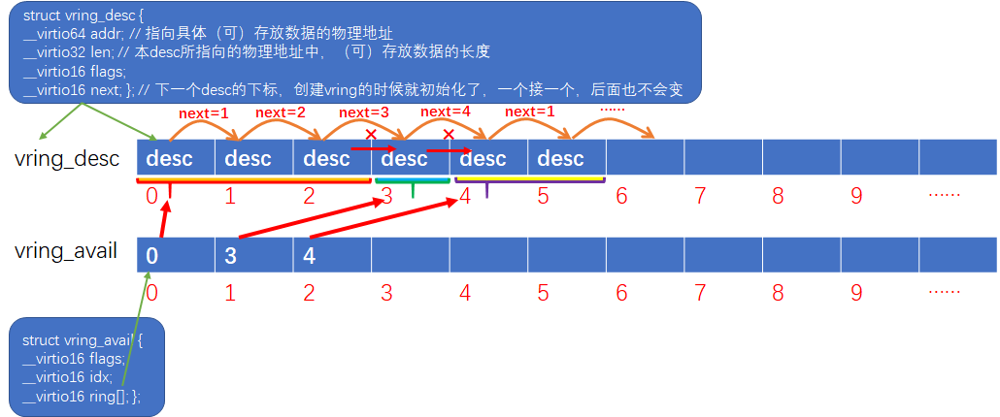

## 1. Vhostuser的ring结构
Virtio设备是支持多队列，每个队列由结构vring_virtqueue定义（可以是收包队列也可以是发包队列），而每个vring_virtqueue中都定义了一个vring结构，负责具体的数据传输。

``` code
// include/uapi/linux/virtio_ring.h
struct vring {
        unsigned int num;

        struct vring_desc *desc;

        struct vring_avail *avail;

        struct vring_used *used;
};
```
可见，ving不是一个ring环，而是包含了三个ring环，利用着三个ring环实现报文的收发。我们通过一张图来描述三个ring环的作用及关系：


**1. vring_desc**
Struct vring_desc并没有定义一个ring环，而是定义了ring环中每个元素的结构。上图中已经对vring_desc各成员做了注解。Desc ring没有消费者和生产者，我们可以把它看作一块用来交互数据的共享内存。

> 说明：vring_desc结构中的addr成员，在Guest向外发包的场景中，指向的是一块承载了发包数据的内存，而在Guest从外面收包的场景中，指向的是一块预分配好的空内存，Host会将收到的包存放到这块空内存中。

**2. vring_avail**
Struct vring_avail是定义了一个ring环的（即成员ring[]），这个ring环的生产者是Guest中的virtio-net，消费者是Host中vhostuser/vhostnet。Avail ring环中每个元素即指向desc ring的下标。

> 说明：Avail ring和desc ring的长度都是一样的，但是avail ring并不会指向desc ring的每一个desc。例如有些skb是由多个分片组成的（scattergather），那么这个skb实际会被转换成多个desc，并且通过vring_desc中的next将多个desc链接在一起，最后一个desc通过flag标记结束。那么这种情况下，Avail ring只会存储第一个desc的下标，同时vring_avail的idx也只累加1。

**3. vring_used**
 Struct vring_used跟vring_avail类似，不过used ring的生产者是vhostnet/vhostuser，消费者是virtio-net。
 
> 说明：used ring中的每个元素包含两个成员id和len，id指向desc ring中的下标，而len则指向desc中所存储数据的长度(通常len成员只在Guest从外面收包的场景中才有效，这个时候desc中len指的是内存中可以最大存储的数据的长度，而user ring中的len指的则是内存中实际存储的数据的长度）。

那么这三个ring在内存中是怎么分布的呢？我们通过一张图描述下：

如图，三个ring是分布在一块连续的内存中的（物理/虚拟地址都是连续的）。最前面是desc ring，接下来是avail ring，最后是used ring。

 