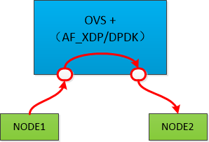
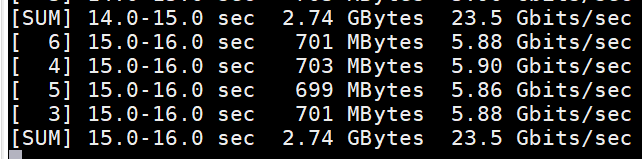
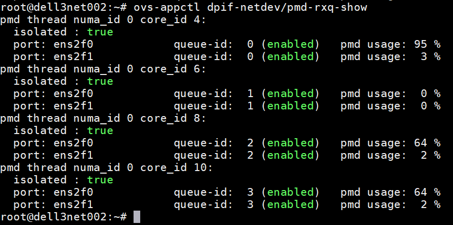
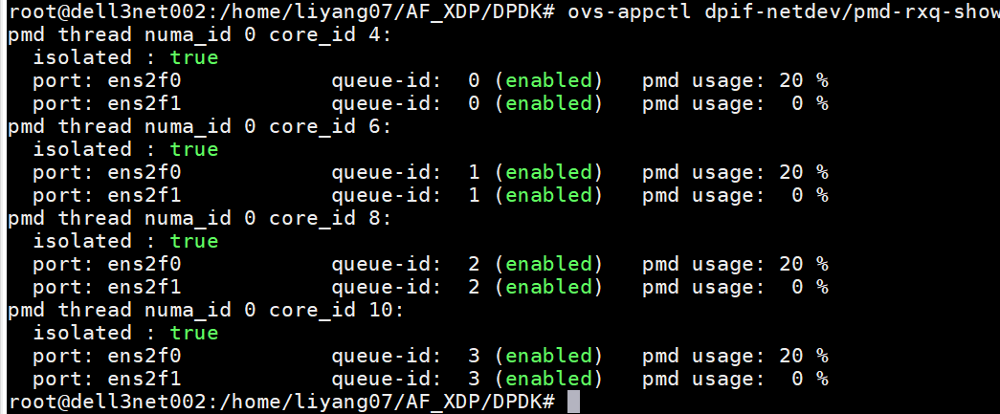
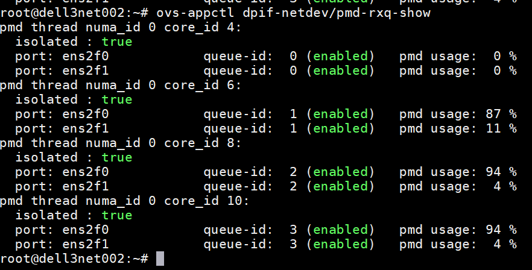
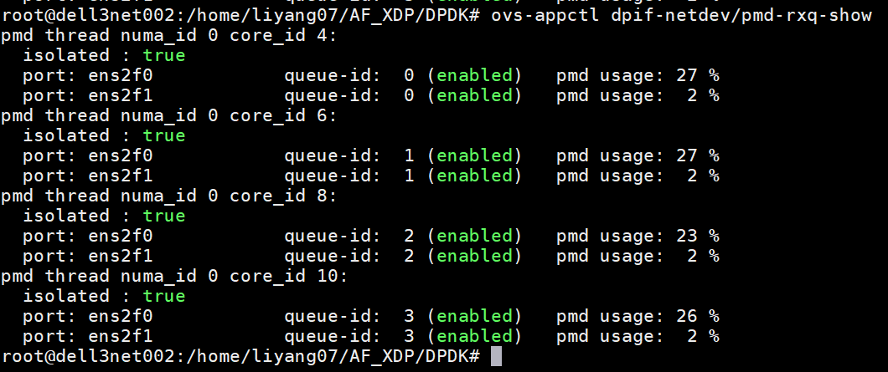
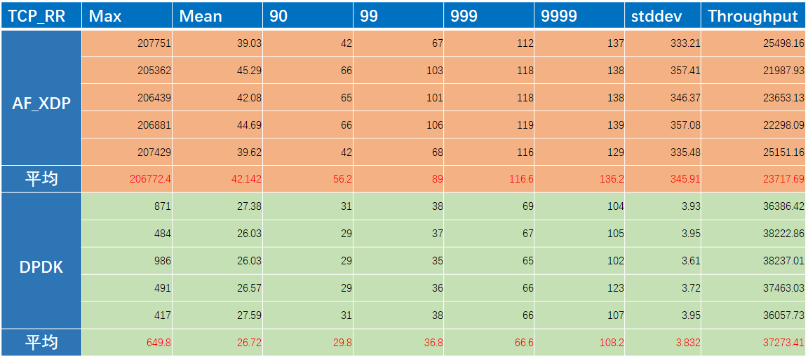
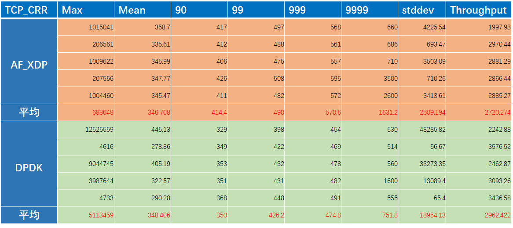

目前 ovs、dpdk、cilium均对 AF_XDP 做了支持，这是否预示在高性能报文转发方面 AF_XDP未来将成为DPDK外又一重要技术分支？加之AF_XDP跟内核更好的配合，随着技术不断程序，AF_XDP是否会全面超越甚至取代DPDK成为高性能报文转发的首选？未来不得而知，但至少从目前看，AF_XDP性能上仍不及DPDK，下面通过一个简单的测试来具体看一下。

> 说明：本次测试，AF_XDP时NATIVE模式，而不是NATIVE_WITH_ZEROCOPY模式，在CX5网卡上 ZEROCOPY开启失败，看来需要网卡的支持，后续再调试解决吧。不开启zerocopy，根据以往测试经验性能可能会有20%-30%的下降。

## 1. 测试拓扑


## 2. 软件版本
OVS-2.12 + DPDK-20.11 + KERNEL-5.4.87，具体要求及ovs编译配置参考：
[Open vSwitch with AF_XDP](https://docs.openvswitch.org/en/latest/intro/install/afxdp/?highlight=native-with-zerocopy#setup-af-xdp-netdev)

## 3. OVS配置

**OVS编译：**

``` 
./configure --prefix=/usr/ --enable-afxdp --with-dpdk --with-debug CFLAGS="-O3"
make && make install
```

**OVS初始化及网络配置：**

``` javascript
/usr/bin/ovs-vsctl --no-wait set Open_vSwitch . other_config:pmd-cpu-mask=0x550

init_dpdk() {
ovs-vsctl set Open_vSwitch . other_config:dpdk-init=true
/usr/bin/ovs-vsctl --no-wait set Open_vSwitch . other_config:dpdk-socket-mem=2048,0
/usr/bin/ovs-vsctl --no-wait set Open_vSwitch . other_config:dpdk-extra="-a 0000:5e:00.0,txq_inline=128,txqs_min_inline=4,txq_mpw_en=0 -a 0000:5e:00.0,txq_inline=128,txqs_min_inline=4,txq_mpw_en=0"
}

add_xdp_port () {
    ovs-vsctl -- add-br br0 \
          -- set Bridge br0 datapath_type=netdev
    ovs-vsctl add-port br0 ens2f0 \
          -- set interface ens2f0 type="afxdp" options:xdp-mode=native-with-zerocopy options:n_rxq=4 other_config:pmd-rxq-affinity="0:4,1:6,2:8,3:10"
    ovs-vsctl add-port br0 ens2f1 \
          -- set interface ens2f1 type="afxdp" options:xdp-mode=native-with-zerocopy options:n_rxq=4 other_config:pmd-rxq-affinity="0:4,1:6,2:8,3:10"
}

add_dpdk_port() {
    ovs-vsctl --may-exist add-br br0 \
          -- set Bridge br0 datapath_type=netdev \
          -- br-set-external-id br0 bridge-id br0 \
          -- set bridge br0 fail-mode=secure

    ovs-vsctl --timeout 10 add-port br0 ens2f0 \
              -- set Interface ens2f0 type=dpdk options:dpdk-devargs=0000:5e:00.0 options:n_rxq=4 other_config:pmd-rxq-affinity="0:4,1:6,2:8,3:10"


    ovs-vsctl --timeout 10 add-port br0 ens2f1 \
              -- set Interface ens2f1 type=dpdk options:dpdk-devargs=0000:5e:00.1 options:n_rxq=4 other_config:pmd-rxq-affinity="0:4,1:6,2:8,3:10"
}

#init_dpdk
#sleep 1
#add_dpdk_port
add_xdp_port
```

**OVS流表配置：**

``` javascript
ovs-ofctl del-flows br0

ovs-ofctl add-flow br0 table=0,priority=0,action=normal

ovs-ofctl add-flow br0 table=1,priority=0,action=normal

ovs-ofctl add-flow br0 table=0,priority=20,ip,dl_src=b8:59:9f:41:0e:d6,in_port=ens2f0,action=load:0-\>NXM_OF_IN_PORT[],goto_table:1

ovs-ofctl add-flow br0 table=0,priority=20,ip,dl_src=b8:59:9f:41:0e:d7,in_port=ens2f1,action=load:0-\>NXM_OF_IN_PORT[],goto_table:1

ovs-ofctl add-flow br0 table=1,priority=20,ip,nw_dst=172.10.1.1,action=set_field:b8:59:9f:41:11:8e-\>eth_src,set_field:b8:59:9f:41:0e:d6-\>eth_dst,output:ens2f0

ovs-ofctl add-flow br0 table=1,priority=20,ip,nw_dst=172.10.2.1,action=set_field:b8:59:9f:41:11:8f-\>eth_src,set_field:b8:59:9f:41:0e:d7-\>eth_dst,output:ens2f1
```

## 4. NODE配置

``` javascript
ip netns add net1
ip netns add net2
sleep 1
ip link set ens2f0 netns net1
ip link set ens2f1 netns net2
sleep 1
ip netns exec net1 ifconfig ens2f0 172.10.1.1/24 up
ip netns exec net2 ifconfig ens2f1 172.10.2.1/24 up
ip netns exec net1 route add -net 172.10.2.0/24 gw 172.10.1.2 dev ens2f0
ip netns exec net2 route add -net 172.10.1.0/24 gw 172.10.2.2 dev ens2f1
```

## 5. 测试结果

### 5.1 Throughput

单口25G网卡，带宽AF_XDP和DPDK两种场景下带宽都能够打满：



我们主要看下，相同带宽下，各自的PMD使用率：





很明显，DPDK PMD使用率更低，并且hash的更均匀；

### 5.2 PPS


AF_XDP：327W pps
DPDK：1400W pps

并且各自峰值的情况下，PMD使用率DPDK仍是全面占优：





### 5.3 Latency

``` javascript
netperf -t TCP_RR -H 172.10.2.1 -l 30 -- -r 1B,1B -O  "MAX_LATENCY,MEAN_LATENCY,P90_LATENCY,P99_LATENCY,P999_LATENCY,P9999_LATENCY,STDDEV_LATENCY,THROUGHPUT,THROUGHPUT_UNITS"
```



``` netperf -t TCP_CRR -H 172.10.2.1 -l 30 -- -r 1B,1B -O  "MAX_LATENCY,MEAN_LATENCY,P90_LATENCY,P99_LATENCY,P999_LATENCY,P9999_LATENCY,STDDEV_LATENCY,THROUGHPUT,THROUGHPUT_UNITS"
```


