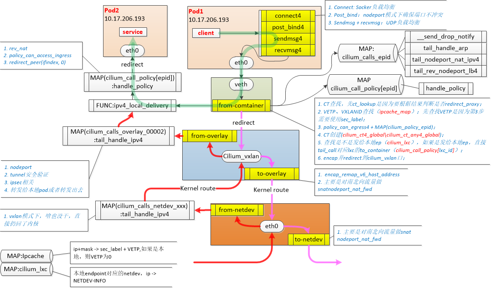
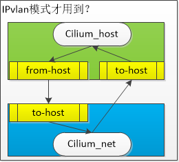
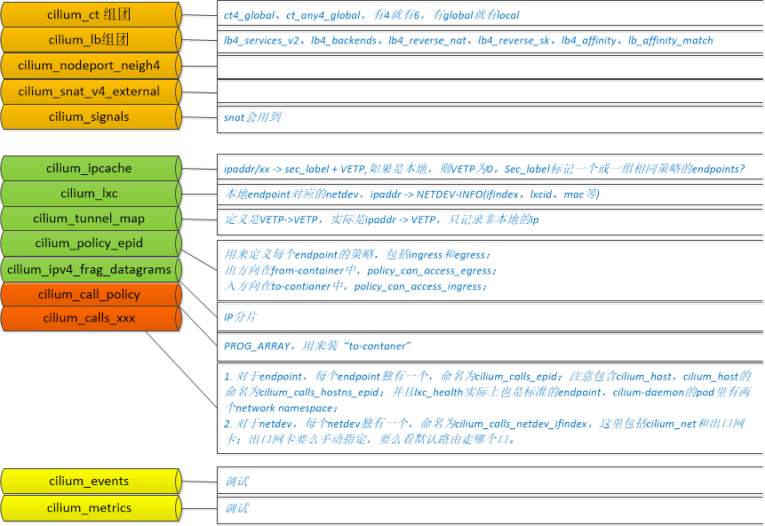

## 1. Cilium datapath的组成

### 1.1 Cilium中的流量劫持点



**所以流量劫持从prog类型上可以分为：**

* 内核层面基于sock的流量劫持，主要用于lb（k8s-proxy）;
* 基于端口流量劫持，实现整个datapath的替换；

**置于cilium_host和cilium_net:**



### 1.2 Cilium中ebpf map的构成



## 2. Cilium datapath加载流程

### 2.1 公共ebpf map的初始化

cilium有很多公用的ebpf map，这些map在ebpf prog加载前被创建：

```
runDaemon() =>NewDaemon() =>Daemon.initMaps()
```

* **cilium\_call\_policy**，PROG\_ARRAY，用来装“to-contaner”
* **cilium\_ct4\_global**，CT表，for tcp
* **cilium\_ct\_any4\_global**，CT表，for non-tcp
* cilium\_events，
* **cilium\_ipcache**，ip+mask -> sec\_label + VETP,如果是本地，则VETP为0
* cilium\_ipv4\_frag\_datagrams
* cilium\_lb4\_affinity
* cilium\_lb4\_backends
* cilium\_lb4\_reverse\_nat
* cilium\_lb4\_reverse\_sk
* cilium\_lb4\_services\_v2
* cilium\_lb\_affinity\_match
* **cilium\_lxc**，本地endpoint对应的netdev，ip -> NETDEV-INFO
* cilium\_metrics
* cilium\_nodeport\_neigh4
* cilium\_signals
* cilium\_snat\_v4\_external
* **cilium\_tunnel\_map**，ip -> VETP，只记录非本地的ip

### 2.2 基础网络构建(init.sh)

#### 2.2.1 初始化参数

* LIB=/var/lib/cilium/bpf，bpf源码所在目录
* RUNDIR=/var/run/cilium/state，工作目录
* IP4\_HOST=10.17.0.7，cilium\_host的ipv4地址
* IP6\_HOST=nil
* MODE=vxlan，网络模式
* **NATIVE\_DEVS**\=eth0，出口网卡，可以手动指定，没指定的话就看默认路由走那个口
* XDP\_DEV=nil
* XDP\_MODE=nil
* MTU=1500
* IPSEC=false
* ENCRYPT\_DEV=nil
* HOSTLB=true
* HOSTLB\_UDP=true
* HOSTLB\_PEER=false
* CGROUP\_ROOT=/var/run/cilium/cgroupv2
* BPFFS\_ROOT=/sys/fs/bpf
* NODE\_PORT=true
* NODE\_PORT\_BIND=true
* MCPU=v2
* NODE\_PORT\_IPV4\_ADDRS=eth0=0xc64a8c0
* NODE\_PORT\_IPV6\_ADDRS=nil
* NR\_CPUS=64

#### 2.2.2 具体工作

1）创建了cilium\_host和cilium\_net；

2）如果是vxlan模式，添加并设置vxlan口cilium\_vxlan；

3）编译并加载cilium\_vxlan相关的prog和map；

> **2个map：**
> 
> * cilium\_calls\_overlay\_2，每个endpoint都有自己独立的tail call map，2是init.sh脚本固定写死的ID\_WORLD；
> * cilium\_encrypt\_state
> 
> **6个prog：**
> 
> * from-container：bpf\_overlay.c
> * to-container：bpf\_overlay.c
> * cilium\_calls\_overlay\_2【1】 = \_\_send\_drop\_notify：lib/drop.h
> * cilium\_calls\_overlay\_2【7】 = tail\_handle\_ipv4：bpf\_overlay.c
> * cilium\_calls\_overlay\_2【15】= tail\_nodeport\_nat\_ipv4：lib/nodeport.h
> * cilium\_calls\_overlay\_2【17】= tail\_rev\_nodeport\_lb4：lib/nodeport.

4）删除出口网卡已经挂载的ebpf程序（from-netdev和to-netdev）

5）加载LB相关ebpf和map；

``` load prog and map
tc exec bpf pin /sys/fs/bpf/tc/globals/cilium\_cgroups\_connect6 obj bpf\_sock.o type sockaddr attach\_type connect6 sec connect6
tc exec bpf pin /sys/fs/bpf/tc/globals/cilium\_cgroups\_post\_bind6 obj bpf\_sock.o type sock attach\_type post\_bind6 sec post\_bind6
tc exec bpf pin /sys/fs/bpf/tc/globals/cilium\_cgroups\_sendmsg6 obj bpf\_sock.o type sockaddr attach\_type sendmsg6 sec sendmsg6
tc exec bpf pin /sys/fs/bpf/tc/globals/cilium\_cgroups\_recvmsg6 obj bpf\_sock.o type sockaddr attach\_type recvmsg6 sec recvmsg6
tc exec bpf pin /sys/fs/bpf/tc/globals/cilium\_cgroups\_connect4 obj bpf\_sock.o type sockaddr attach\_type connect4 sec connect4
tc exec bpf pin /sys/fs/bpf/tc/globals/cilium\_cgroups\_post\_bind4 obj bpf\_sock.o type sock attach\_type post\_bind4 sec post\_bind4
tc exec bpf pin /sys/fs/bpf/tc/globals/cilium\_cgroups\_sendmsg4 obj bpf\_sock.o type sockaddr attach\_type sendmsg4 sec sendmsg4
tc exec bpf pin /sys/fs/bpf/tc/globals/cilium\_cgroups\_recvmsg4 obj bpf\_sock.o type sockaddr attach\_type recvmsg4 sec recvmsg4
```

6）XDP、FLANNEL、IPSEC相关初始化暂未研究

### 2.3 剩余的初始化工作

1）cilium\_host的datapath

```
tc[filter replace dev cilium_host ingress prio 1 handle 1 bpf da obj 554_next/bpf_host.o sec to-host]
tc[filter replace dev cilium_host egress prio 1 handle 1 bpf da obj 554_next/bpf_host.o sec from-host]
```

> **说明**：加载了2 + 5 个prog，1个PROG\_ARRAY map，1个cilium\_policy\_00554 map
> 
>  - PROG：
>  from-host、to-host
>  - PROG_ARRAY_MAP：
>  cilium\_calls\_hostns\_00554（554是epid）
>  - PROG IN PROG_ARRAY_MAP：
>  cilium\_calls\_hostns\_00554【1】= \_\_send\_drop\_notify
>  cilium\_calls\_hostns\_00554【7】=  tail\_handle\_ipv4\_from\_netdev => tail\_handle\_ipv4(ctx,false)
>  cilium\_calls\_hostns\_00554【15】= tail\_nodeport\_nat\_ipv4
>  cilium\_calls\_hostns\_00554【17】= tail\_rev\_nodeport\_lb4
>  cilium\_calls\_hostns\_00554【22】= tail\_handle\_ipv4\_from\_host => tail\_handle\_ipv4(ctx, true)

2）cilium\_net的datapath

```
tc[filter replace dev cilium_net ingress prio 1 handle 1 bpf da obj 554_next/bpf_host_cilium_net.o sec to-host]
```

>  - **说明**：加载了1 + 5个prog，1个PROG\_ARRAY map
>  - PROG：
>  to-host
>  - PROG_ARRAY_MAP：
>  cilium\_calls\_netdev\_00004（4是ifindex，ip link命令可以查看）
>  - PROG IN PROG_ARRAY_MAP：
>  cilium\_calls\_netdev\_00004【1】= \_\_send\_drop\_notify
>  cilium\_calls\_netdev\_00004【7】=  tail\_handle\_ipv4\_from\_netdev => tail\_handle\_ipv4(ctx,false)
>  cilium\_calls\_netdev\_00004【15】= tail\_nodeport\_nat\_ipv4
>  cilium\_calls\_netdev\_00004【17】= tail\_rev\_nodeport\_lb4
>  cilium\_calls\_netdev\_00004【22】= tail\_handle\_ipv4\_from\_host => tail\_handle\_ipv4(ctx, true)

3）eth0的datapath

```
tc[filter replace dev eth0 ingress prio 1 handle 1 bpf da obj 554_next/bpf_netdev_eth0.o sec from-netdev]
tc[filter replace dev eth0 egress prio 1 handle 1 bpf da obj 554_next/bpf_netdev_eth0.o sec to-netdev]
```

> \*\*说明：\*\*加载了2+5个prog，1个PROG\_ARRAY map
> 
>  - PROG：
>  from-netdev、to-netdev
>  - PROG_ARRAY_MAP：
>  cilium\_calls\_netdev\_00002（4是ifindex，ip link命令可以查看）
>  - PROG IN PROG_ARRAY_MAP：
>  cilium\_calls\_netdev\_00002【1】= \_\_send\_drop\_notify
>  cilium\_calls\_netdev\_00002【7】=  tail\_handle\_ipv4\_from\_netdev => tail\_handle\_ipv4(ctx,false)
>  cilium\_calls\_netdev\_00002【15】= tail\_nodeport\_nat\_ipv4
>  cilium\_calls\_netdev\_00002【17】= tail\_rev\_nodeport\_lb4
>  cilium\_calls\_netdev\_00002【22】= tail\_handle\_ipv4\_from\_host => tail\_handle\_ipv4(ctx, true)

4）lxc\_health的datapath，**跟增加一个pod的datapath是完全一样的**

```
tc[filter replace dev lxc_health ingress prio 1 handle 1 bpf da obj 908_next/bpf_lxc.o sec from-container]
```

> **说明**：加载了1+4+1个prog，1个PROG\_ARRAY map，1个cilium\_policy\_00908 map
> 
>  - PROG：
>  from-container
>  - PROG IN PROG_ARRAY_MAP：
>  cilium\_calls\_00908【1】=  \_\_send\_drop\_notify
>  cilium\_calls\_00908【6】= tail\_handle\_arp
>  cilium\_calls\_00908【15】= tail\_nodeport\_nat\_ipv4
>  cilium\_calls\_00908【17】= tail\_rev\_nodeport\_lb4
>  cilium\_call\_policy\[908\] = handle\_policy(to-container好像已经废弃了)