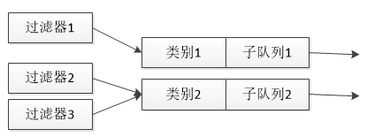
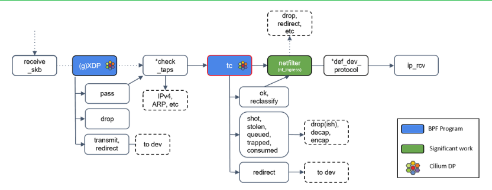

## 1\. TC的几个概念

* 队列——qdisc(queueing discipline)，分为不可分类队列（classless qdisc）和可分类队列（classful qdisc）,一个qdisc会被分配一个主序列号，叫做句柄(handle)，然后把从序列号作为类的命名空间。句柄采用象10:一样的表达方式。习惯上，需要为有子类的QDisc显式地分配一个句柄。队列真正的实现QoS功能；
* 类别——class，通过分类器将流量划分为不同的class，一个class对应一个qos对象（即一个具体的可以配置qos策略的子队列），添加class的时候需要指定该class对应的qos策略（就是给多少带宽这种）；
* 分类器——filter，用于将流量划分为不同的class；

**用一张图表示三者的关系，如下图所示：**



## 2\. 举个简单的TC例子

### 2.1 创建队列

有关队列的TC命令的一般形式为:

```
tc qdisc [add|change|replace|link] dev DEV [parent qdisk-id|root][handle qdisc-id] qdisc[qdisc specific parameters]
```

首先，需要为网卡eth0配置一个HTB队列，使用下列命令:

```
tc qdisc add dev eth0 root handle 1:htb default 11
```

**参数说明：**

* add 表示要添加
* dev eth0 表示要操作的网卡为eth0
* root 表示为网卡eth0添加的是一个根队列
* handle 1: 表示队列的句柄为1:
* htb 表示要添加的队列为HTB队列
* 命令最后的”default 11 是htb特有的队列参数，意思是所有未分类的流量都将分配给类别1:11

### 2.2 创建类别

有关类别的TC 命令的一般形式为:

```
tc class [add|change|replace] dev DEV parent qdisc-id [classid class-id] qdisc [qdisc specific parameters]
```

可以利用下面这三个命令为根队列1创建三个类别，分别是1:11、1:12和1:13，它们分别占用40、40和20mb\[t的带宽。

```
tc class add dev eth0 parent 1: classid 1:11 htb rate 40mbit ceil 40mbit
tc class add dev eth0 parent 1: classid 1:12 htb rate 40mbit ceil 40mbit
tc class add dev eth0 parent 1: cllassid 1:13 htb rate 20mbit ceil 20mbit
```

**参数说明：**

* parent 1: 表示类别的父亲为根队列1:
* classid1:11 表示创建一个标识为1:11的类别
* rate 40mbit 表示系统将为该类别确保带宽40mbit
* ceil 40mbit 表示该类别的最高可占用带宽为40mbit

**注意， 在TC 中使用下列的缩写表示相应的带宽：**

* Kbps kiIobytes per second， 即”千字节每秒
* Mbps megabytes per second， 即”兆字节每秒
* Kbit kilobits per second，即”千比特每秒
* Mbit megabits per second， 即”兆比特每秒

### 2.3 创建分类器

有关过滤器的TC 命令的一般形式为:

```
tc filter [add|change|replace] dev DEV [parent qdisc-id|root] protocol protocol prio priority filtertype [filtertype specific parameters] flowid flow-id
```

由于需要将WWW、E-mail、Telnet三种流量分配到三个类别，即上述1:11、1:12和1:13，因此，需要创建三个过滤器，如下面的三个命令:

```
tc filter add dev eth0 protocol ip parent 1:0 prio 1 u32 match ip dport 80 0xffff flowid 1:11
tc filter add dev eth0 prtocol ip parent 1:0 prio 1 u32 match ip dport 25 0xffff flowid 1:12
tc filter add dev eth0 protocol ip parent 1:0 prio 1 u32 match ip dport 23 oxffff flowid 1:13
```

**参数说明：**

* protocol ip 表示该过滤器应该检查报文分组的协议字段
* prio 1 表示它们对报文处理的优先级是相同的，对于不同优先级的过滤器， 系统将按照从小到大的优先级顺序来执行过滤器，对于相同的优先级，系统将按照命令的先后顺序执行。

这几个过滤器还用到了u32选择器(命令中u32后面的部分)来匹配不同的数据流。以第一个命令为例，判断的是dport字段，如果该字段与Oxffff进行与操作的结果是80，则“flowid 1:11” 表示将把该数据流分配给类别1:11

### 2.4 ingress qdisc

* ingress qdisc没有任何参数，我们可以像下面这样添加一个ingress qdisc:

~~~
tc qdisc add dev eth0 ingress
~~~

* ingress qdisc不占用根队列，创建ingress qdisc后我们还能继续创建其他的tx的qdisc；
* ingress qdisc不支持任何子类别，所以我们无法为ingress qdisc创建class，但是我们可以直接为ingress qdisc创建分类器；

~~~
tc qdisc add dev eth0 handle ffff: ingress 
tc filter add dev eth0 parent ffff: protocol all prio 49 basic police rate 10mbit burst 1mb mtu 65535 drop
~~~

police参考：[https://man7.org/linux/man-pages/man8/tc-police.8.html](https://man7.org/linux/man-pages/man8/tc-police.8.html)

**参数说明：**

* rate 限制的最大流量？后面的drop动作是指超过限速的流量还是命中的流量？？？
* burst 每个计时器的流量峰值，应该同HTB的burst
* mtu 匹配的mtu
* drop ？

## 3\. 如何使用tc的ebpf功能

从内核4.1版本起，tc引入了一个特殊的qdisc，叫做clsact，它为TC提供了一个可以加载BPF程序的入口，使TC和XDP一样，成为一个可以加载BPF程序的网络钩子。



**TC vs XDP**

这两个钩子都可以用于相同的应用场景，如DDoS缓解、隧道、处理链路层信息等。但是，由于XDP在任何套接字缓冲区（SKB）分配之前运行，所以它可以达到比TC上的程序更高的吞吐量值。然而，后者可以从通过 struct \_\_sk\_buff 提供的额外的解析数据中受益，并且可以执行 BPF 程序，对入站流量和出站流量都可以执行 BPF 程序，是 TX 链路上的能被操控的最后一个点。

**无需网卡驱动的支持**

tc BPF 程序不需要驱动做任何改动，因为它们运行在网络栈通用层中的 hook 点。因此，它们可以 attach 到任何类型的网络设备上。

**Ingress**

这提供了很好的灵活性，但跟运行在原生 XDP 层的程序相比，性能要差一些。然而，tc BPF 程序仍然是内核的通用 data path 做完 GRO 之后、且处理任何协议之前 最早的 处理点。传统的 iptables 防火墙也是在这里处理的，例如 iptables PREROUTING 或 nftables ingress hook 或其他数据包包处理过程。

**Egress**

类似的，对于 egress，tc BPF 程序在将包交给驱动之前的最晚的地方（latest point）执 行，这个地方在传统 iptables 防火墙 hook 之后（例如 iptables POSTROUTING）， 但在内核 GSO 引擎之前。

\*\*详细参考：\*\*

[http://arthurchiao.art/blog/cilium-bpf-xdp-reference-guide-zh/#prog\_type\_tc](http://arthurchiao.art/blog/cilium-bpf-xdp-reference-guide-zh/#prog_type_tc)

## 4\. 最佳实践

参考：[https://github.com/rexrock/tc-xdp-drop-tcp](https://github.com/rexrock/tc-xdp-drop-tcp)

注意：需使用4.20及以上版本的内核，才能使veth支持XDP
