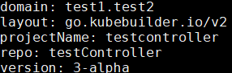
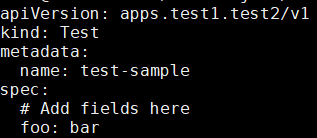
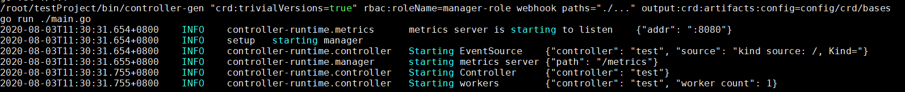
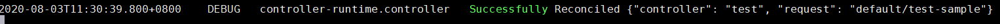
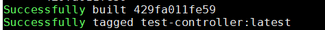

## 1. 安装kubebuilder

建议源码安装更容易些：

```
git clone https://github.com/kubernetes-sigs/kubebuilder.git
cd kubebuilder/
make install
./bin/kubebuilder version
```

将./bin/kubebuilde拷贝到可执行路径

## 2. 使用kubebuilder创建CRD及Controller

官方参考文档：

[https://book-v1.book.kubebuilder.io/quick\_start.html](https://book-v1.book.kubebuilder.io/quick_start.html)

其他参考文档：

[https://www.cnblogs.com/alisystemsoftware/p/11580202.html](https://www.cnblogs.com/alisystemsoftware/p/11580202.html)

[https://blog.csdn.net/qianggezhishen/article/details/106995181](https://blog.csdn.net/qianggezhishen/article/details/106995181)

### 2.1 准备工作

```
mkdir -p testProject/src/testController
cd testProject/
export PATH=$PATH:/root/go/bin/
export GOPATH=$PWD
# 强制启用go module
export GO111MODULE=on
# 配置默认从goproxy.io拉去go mod的依赖包，goproxy.io是国内七牛云维护的一个golang包代理库
export GOPROXY=https://goproxy.io
cd src/testController
```

### 2.2 创建PROJECT

~~~
kubebuilder init --domain test1.test2 --license apache2 --owner "The Kubernetes Authors"
cat PROJECT
~~~



### 2.3 创建API

~~~
kubebuilder create api --group apps --version v1 --kind Test
cat config/samples/apps_v1_test.yaml
~~~



### 2.4 Install the CRDs into the cluster

```
make install
```

### 2.5 在本地运行Controller

```
make run
```



### 2.6 创建Resource of CRD

```
kubectl create -f config/samples/apps_v1_test.yaml
```

可以看到controller的日志打印如下



### 2.7 编译打包

首先修改Dockerfile：
*1）在RUN go mod download前插入一行ENV GOPROXY=https://goproxy.cn,direct*
*2）将FROM *[*gcr.io/distroless/static:nonroot改为FROM*](http://gcr.io/distroless/static:nonroot%E6%94%B9%E4%B8%BAFROM)* golang:1.13*
*3）删除USER nonroot:nonroot*
然后运行：

```
docker build -t test-controller .
```

成功会看到



可以通过docker images命令查看镜像，或者通过docker save和docker load导出和导入。

## 3. 创建Core Resource的controller

参考：

[https://book-v1.book.kubebuilder.io/beyond\_basics/controllers\_for\_core\_resources.html](https://book-v1.book.kubebuilder.io/beyond_basics/controllers_for_core_resources.html)

1. 创建后需要修改controllers/deployment\_controller.go文件：
    
       import添加：corev1 "[k8s.io/api/core/v1](http://k8s.io/api/core/v1)"
       import删除：appsv1 "testController/api/v1"

2. 修改函数SetupWithManager：
         
	   将For(&appsv1.Test{})改为For(&corev1.Pod{})
       然后重新make run，则会收到pod创建、删除的event消息
