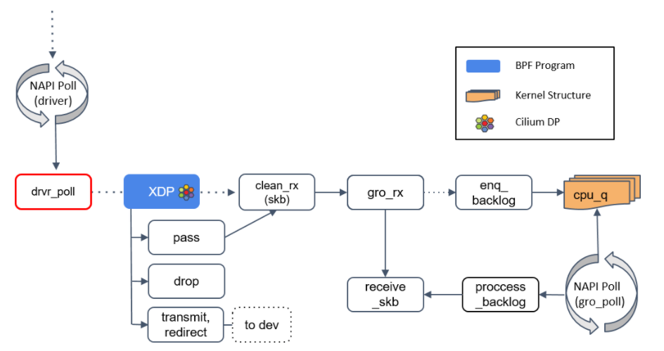

## 1. XDP程序的运行位置
XDP（eXpress Data Path）提供了一个内核态、高性能、可编程 BPF 包处理框架。这个框架在软件中最早可以处理包的位置（即网卡驱动收到包的 时刻）运行 BPF 程序。如下图所示：



NAPI poll 机制不断调用驱动实现的 poll 方法，后者处理 RX 队列内的包，并最终将包送到正确的程序，也就是我们所说的 XDP 程序。所以很明显这需要网卡驱动的支持，如果驱动支持 XDP ，那 XDP 程序将在 poll 机制内执行。如果不支持，那 XDP 程序将只能在更后面的位置被执行，即上图中的receive_skb中。这其中经历了哪些步骤呢？

 1. 创建skb，如果不支持XDP，poll机制会将报文送给 clean_rx()，该函数会创建一个skb，并skb进行一些硬件校验何检查，然后较给 gro_receive() 函数；
 2. 分片重组，GRO可以理解为LRO的软件实现，相比LRO只针对TCP报文，GRO可以处理更多其他类型的报文，总之在 gro_receive() 函数中，如果是分片报文则进行分片重组然后交给 receive_skb() 函数，如果不是分片报文，则直接交给 receive_skn() 函数进行处理；

## 2. XDP的三种工作模式

上面提到XDP程序可以运行在不同位置，每个位置即对应XDP的一种工作模式：

 - Native XDP，即运行在网卡驱动实现的的 poll() 函数中，需要网卡驱动的支持；
 - Generic XDP，即上面提到的如果网卡驱动不支持XDP，则可以运行在 receive_skb() 函数中；
 - Offloaded XDP，这种模式是指将XDP程序offload到网卡中，这需要网卡硬件的支持，JIT编译器将BPF代码翻译成网卡原生指令并在网卡上运行。

## 3. XDP程序的返回码
XDP程序执行结束后会返回一个结果，告诉调用者接下来如何处理这个包：

 - XDP_DROP，丢弃这个包，主要用于报文过滤的安全场景；
 - XDP_PASS，将这个包“交给/还给”内核，继续走正常的内核处理流程；
 - XDP_TX，从收到包的网卡上再将这个包发出去（即hairpin模式），主要用于负载均衡场景；
 - XDP_REDIRECT，何XDP_TX类似，但是是通过另外一个网卡将包发出去。除此之外还可以实现将报文重定向到其他的CPU处理，类似于XDP_PASS继续走内核处理流程，但是由其他的CPU处理，当前CPU继续处理后续的报文接收；
 - XDP_ABORTED，表示程序产生异常，行为类似XDP_DROP，但是会通过一个tracepoint打印日志义工追踪；

下面是 Mellanox mlx5 驱动中关于XDP的处理，如果该函数返回 true，则说明报文被XDP处理了，不用再走内核协议栈了，如果返回 false 则创建SKB然后继续走内核协议栈：

```
/* returns true if packet was consumed by xdp */
bool mlx5e_xdp_handle(struct mlx5e_rq *rq, struct mlx5e_dma_info *di,
                      u32 *len, struct xdp_buff *xdp)
{
        struct bpf_prog *prog = rcu_dereference(rq->xdp_prog);
        u32 act;
        int err;

        if (!prog)
                return false;

        act = bpf_prog_run_xdp(prog, xdp);
        switch (act) {
        case XDP_PASS:
                *len = xdp->data_end - xdp->data;
                return false;
        case XDP_TX:
                if (unlikely(!mlx5e_xmit_xdp_buff(rq->xdpsq, rq, di, xdp)))
                        goto xdp_abort;
                __set_bit(MLX5E_RQ_FLAG_XDP_XMIT, rq->flags); /* non-atomic */
                return true;
        case XDP_REDIRECT:
                if (xdp->rxq->mem.type != MEM_TYPE_XSK_BUFF_POOL) {
                        page_ref_sub(di->page, di->refcnt_bias);
                        di->refcnt_bias = 0;
                }
                /* When XDP enabled then page-refcnt==1 here */
                err = xdp_do_redirect(rq->netdev, xdp, prog);
                if (unlikely(err))
                        goto xdp_abort;
                __set_bit(MLX5E_RQ_FLAG_XDP_XMIT, rq->flags);
                __set_bit(MLX5E_RQ_FLAG_XDP_REDIRECT, rq->flags);
                if (xdp->rxq->mem.type != MEM_TYPE_XSK_BUFF_POOL)
                        mlx5e_page_dma_unmap(rq, di);
                rq->stats->xdp_redirect++;
                return true;
        default:
                bpf_warn_invalid_xdp_action(act);
                fallthrough;
        case XDP_ABORTED:
xdp_abort:
                trace_xdp_exception(rq->netdev, prog, act);
                fallthrough;
        case XDP_DROP:
                rq->stats->xdp_drop++;
                return true;
        }
}

```

**疑问？**
如果我们相对报文执行 redirect，那么我们在BPF程序中需要执行 bpf_redirect() / bpf_redirect_map()，但是从上卖弄的代码中看，从我们的BPF程序返回后，驱动程序也调用了一个叫做 xdp_do_redirect() 的函数。那么问题来了，报文的 redirect 到底是在什么时候执行的呢？答案后面揭晓。


