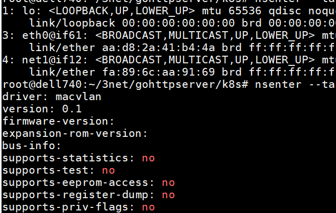

sriov-network-device-plugin需基于multus/danm和srioc-cni，所以我们依次安装multus、sriov-cni、sriov-network-device-plugin。

# 1\. 安装Multus

Multus项目地址：\[[https://github.com/intel/multus-cni.git](https://github.com/intel/multus-cni.git)\]([https://github.com/intel/multus-cni.git](https://github.com/intel/multus-cni.git)

```
cd multus-cni-master
kubectl create -f ./images/multus-daemonset.yml
```

**部署完成后：**

* 每个node上都会运行一个multus的守护进程；
* 获取当前“主cni”配置，并创建一个新的multus cni配置/etc/cni/net.d/00-multus.conf，以劫持cni

**配置入口：**

* 创建/etc/cni/net.d/multus.d，用来存储multus访问API server的验证文件；
    
**验证安装是否成功：**

```
# kubectl get pods --all-namespaces | grep -i multus
kube-system   kube-multus-ds-amd64-4ncw6                     1/1     Running   0          17h
kube-system   kube-multus-ds-amd64-jgzp4                     1/1     Running   2          24h
```

OK，让我们用macvlan口来验证一下Multus是否可以正常工作。

```
apiVersion: "k8s.cni.cncf.io/v1"
kind: NetworkAttachmentDefinition
metadata:
  name: macvlan-conf
spec:
  config: '{
      "cniVersion": "0.3.0",
      "type": "macvlan",
      "master": "bond2.100",
      "mode": "bridge",
      "ipam": {
        "type": "host-local",
        "subnet": "192.168.1.0/24",
        "rangeStart": "192.168.1.200",
        "rangeEnd": "192.168.1.216",
        "routes": [
          { "dst": "0.0.0.0/0" }
        ],
        "gateway": "192.168.1.1"
      }
    }'
```

Multus在部署的时候，顺便创建了一个CRD，用来让用户定义想要添加什么样的“副CNI”。上面的配置定义了我们想要给指定的pod添加基于macvlan的网口。下面让我来创建一个需要添加macvlan接口的pod：

~~~
apiVersion: v1
kind: Pod
metadata:
  name: samplepod
  annotations:
    k8s.v1.cni.cncf.io/networks: macvlan-conf
spec:
  containers:
  - name: samplepod
    command: ["/bin/ash", "-c", "trap : TERM INT; sleep infinity & wait"]
    image: alpine
~~~

**注意：**

    并不是所有的pod创建都会自动添加副接口，我们需要通过annotations指定，我们想要给pod添加“哪些”副接口。pod成功Running后，我们查看pod里面的网卡配置，可以看到名为net1的我们创建的macvlan接口：



OK，如果我们想要添加更多的“副接口”呢，配置如下：

```
apiVersion: v1
kind: Pod
metadata:
  name: samplepod
  annotations:
    k8s.v1.cni.cncf.io/networks: macvlan-conf, sriov-net1 # 新增sriov-net1类型的接口
spec:
  containers:
  - name: samplepod
    command: ["/bin/ash", "-c", "trap : TERM INT; sleep infinity & wait"]
    image: alpine
    resources: # 这是sriov接口特有的配置，这里先忽略
      requests:
        intel.com/mlnx_sriov: '1'
      limits:
        intel.com/mlnx_sriov: '1'
```

应用后，我们可以分别看到名为net1的vxlan接口和名为net2的sriov接口：


说明：上述配置是我在以完成sriov-network-device-plugin安装的情况下才可以配置sriov接口。

# 2\. 安装sriov-cni

项目地址：[https://github.com/k8snetworkplumbingwg/sriov-cni.git](https://github.com/k8snetworkplumbingwg/sriov-cni.git)

没有太多好讲的，把二进制编译出来放到/opt/cni/bin/目录下即可：

```
# git clone https://github.com/k8snetworkplumbingwg/sriov-cni.git
# cd sriov-cni
# make
# cp build/sriov /opt/cni/bin
```

一般cni的安装需要cni二进制（/opt/cni/bin/）+cni配置文件（/etc/cni/net.d/），因为这里所有的cni配置已经被multus劫持，所以只需要安装二进制文件即可，而具体的每个副cni配置则通过multus的CRD NetworkAttachmentDefinition来定义。

# 3\. 安装sriov-network-device-plugin

项目地址：[https://github.com/k8snetworkplumbingwg/sriov-network-device-plugin.git](https://github.com/k8snetworkplumbingwg/sriov-network-device-plugin.git)

```
# git clone https://github.com/k8snetworkplumbingwg/sriov-network-device-plugin.git
# cd sriov-network-device-plugin/
```

这里需要编辑下configmap文件，这个configmap使用来定义sriov资源的，我用的mellanox网卡，配置如下：


**参数解析：**

 - vendors通过lspci -v -s pci\_addr可以查看；
 - devices，我的网卡pf时1017，vf是1018，包括驱动，dpdk-devbind.py都可以查看。

**开始部署：**
```
# kubectl create -f configMap.yaml
# kubectl create -f k8s-v1.16/sriovdp-daemonset.yaml
# kubectl get pod --all-namespaces | grep sriov
kube-system   kube-sriov-device-plugin-amd64-5vsnr           1/1     Running   0          18h
kube-system   kube-sriov-device-plugin-amd64-lr8wh           1/1     Running   0          19h
```

sriov-device-plugin成功部署，我们可以看到vf被添加到相应的资源池：

```
# kubectl get node dell740.it.163.org -o json | jq '.status.allocatable'
{
  "cpu": "48",
  "ephemeral-storage": "260988928388",
  "hugepages-1Gi": "0",
  "hugepages-2Mi": "0",
  "intel.com/intel_sriov_dpdk": "0",
  "intel.com/intel_sriov_netdevice": "0",
  "intel.com/mlnx_sriov": "24",
  "memory": "394747480Ki",
  "pods": "110"
}
```

OK，sriov-device-plugin到现在算是部署成功了，接下来我们可以创建基于sriov的“副CNI”了：

```
apiVersion: "k8s.cni.cncf.io/v1"
kind: NetworkAttachmentDefinition
metadata:
  name: sriov-net1
  annotations:
    k8s.v1.cni.cncf.io/resourceName: intel.com/mlnx_sriov
spec:
  config: '{
  "type": "sriov",
  "cniVersion": "0.3.1",
  "name": "sriov-network",
  "ipam": {
    "type": "host-local",
    "subnet": "172.10.1.0/24",
    "routes": [{
      "dst": "0.0.0.0/0"
    }]
  }
}'
```

注意：annotations里指定的resourceName，必须跟前面configmap定义的资源名称“完全一致”。

OK，创建基于sriov的pod的配置前面已经贴过了。置于configmap以及pod yaml中的配置参数，可以参考项目中的文档。


